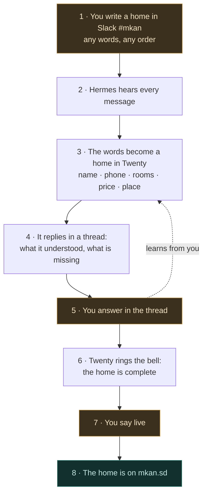

**Home** is the lane that turns a few words typed into Slack into a home for rent on
mkan.sd. The scene it is built for: you go to meet a host, sit with him, ask what you need
to know to list his places, and on the way back you type it into `#mkan` from your phone —
a name, a phone number, rooms, a price, a neighbourhood — in any order, in Arabic or
English. The channel is your field notebook; the engine does the rest. The engine reads every message in
`#mkan`, decides on its own whether it is a home, makes a record of it in the Twenty CRM,
tells you what it understood and what is still missing, and rings a bell when the home has
enough to go live. Then you say `live`, and it is on the site.

The one rule that outranks speed: **the words are yours, the record is a mirror of them,
and nothing goes live without your yes.** The engine never invents a price, a room, or a
phone number. What it did not understand it keeps as your words, verbatim, on the record —
and every correction you make teaches it your way of writing.

## How a home travels

Eight steps. You touch three of them (1, 5, 7); the rest happen on their own.



### What each box means

| Box | In plain words |
| --- | --- |
| **1 · You write a home in Slack** | One message in `#mkan`, typed after meeting the host. A name, a phone, "two rooms, a hall, a bathroom, a kitchen". No form, no order, no special word to start with. A numbered list is several homes of the same host. |
| **2 · Hermes hears every message** | The gateway on this Mac is woken by every message in the channel and runs one command. It never reads the words itself and never answers in its own voice — it is the ear, not the brain. |
| **3 · The words become a home in Twenty** | A script reads your message straight from Slack, asks Claude what it says, checks the answer against the CRM's own field list, and creates one `home` record per unit — with a code like `0005-01` once it knows the host. Your original words are kept on the record as a note. |
| **4 · It replies in a thread** | Under your message: the record link, the code, what it understood (rooms, price, place…), and what is still missing — the must-haves first. |
| **5 · You answer in the thread** | "The price is 40 thousand", "three bathrooms not two", "it is in Salalab". The record is updated; the reply says what changed. Whatever you correct becomes a test case for the next version of the reader. |
| **6 · Twenty rings the bell** | When the must-haves are all there and you have confirmed the price with the host, the record moves to the stage that means *ready*, and the thread says so. |
| **7 · You say live** | `live 0005-01` in the thread. Only a person says this — never the machine. |
| **8 · The home is on mkan.sd** | The site gets the listing with its code, Twenty is updated to match, and the thread carries the link: `mkan.sd/ar/listings/0005-01`. |

> **Box 2 is the only box that is not ready.** Everything it needs exists and is running,
> except one Slack permission that only a workspace admin can click — see
> [Blocked on exactly one human action](#blocked-on-exactly-one-human-action).

## The parts

Six parts. Each one does a single thing:

| Part | What it does |
| --- | --- |
| **Slack `#mkan`** | Where you write, and where you are answered. Private channel `C0BS2NZE2AY` — already the mastering cockpit, so photos and homes share one room. |
| **Hermes** | The ear. NousResearch's [hermes-agent](/docs/hermes), the `h` lane, connected to Slack over Socket Mode from this Mac. Holds a one-line skill: hear a message, run the sweep, stay silent. |
| **The script** (mkan) | The hands. `scripts/crm/home-intake.ts` — reads the message from Slack, extracts, validates, writes Twenty, writes the site on `live`, and posts every reply as the same `kun` bot. Also runs on a two-minute timer, so a home is caught even when Hermes is down. |
| **Claude** | The reader. `claude -p` on the Max plan turns your words into fields under a frozen, versioned prompt. No API key, no per-message cost. |
| **Twenty `home`** | The record. The mkan workspace already carries everything this lane needs — ~100 fields, 147 homes today. Nothing new is added to the CRM. |
| **The site** | The truth. mkan Prisma is where a listing lives; Twenty mirrors it. `live` writes the site first, then updates Twenty. |

## What you can write

You came back from a host's door with what he told you. Your own example, exactly as
you would type it:

```
1. احمد ٠٩١٢٣١٠٢٠٥ الشقة الاولي غرفتين صالة حمام مطبخ
```

reads as: host **أحمد**, phone **+249 91 231 0205** (Arabic digits are read as digits,
`09…` becomes `+249…`), home **1**: two bedrooms, a hall, one bathroom, a kitchen. The reply
asks for what is missing — the price, the neighbourhood or a map link — and offers a title.

Several homes of one host, in one message:

```
احمد ٠٩١٢٣١٠٢٠٥ — حي الثورة، قريب من المطار
1. الشقة الاولى غرفتين صالة حمام مطبخ ٣٠ الف الليلة
2. الشقة الثانية ثلاث غرف صالتين حمامين مطبخ مكيف ٤٥ الف
3. استوديو غرفة وحمام ١٥ الف
```

reads as three homes — `0005-01`, `0005-02`, `0005-03` — under the same host, all in
Al-Thawra, priced 30,000 / 45,000 / 15,000 SDG a night. The third is a studio, which the
CRM calls `ROOMS`.

In English, with a map link:

```
Fatima 0912 555 000 — villa in Salalab near the sea, 4 bedrooms 3 bathrooms,
AC, generator, 80k/night https://maps.app.goo.gl/…
```

### What gets picked out

| You write | It becomes | Needed for live? |
| --- | --- | --- |
| a phone number, in any digits | `hostPhone` as `+249…`, plus the host record | **yes** — someone to call |
| a person's name | `hostName` | expected, not required |
| 2 bedrooms · `غرفتين` | `bedrooms` | **yes** |
| 3 bathrooms · `حمامين` | `bathrooms` | **yes** |
| villa · `فيلا` · `شقة` · `استوديو` | `propertyType` | **yes** |
| 30k/night · `٣٠ الف الليلة` | `priceNightSdg` | **yes** |
| a neighbourhood · a map link | `zone` (45 Port Sudan zones) · `googleMapsUrl` | **yes** — one of the two |
| a title, a description | `titleAr`, `descriptionAr` (English mirrored later) | **yes** — drafted from the facts if you did not write them; you see the draft before `live` |
| wifi · `صالة` · `مطبخ` · `مكيف` | `highlights` · `amenities` | nice |
| sleeps 4 · `٤ اشخاص` · `سريرين` | `guestCapacity` · `beds` | nice |
| numbered lines `1.` `2.` `3.` | one home per number, same host, codes in order | identity |
| price confirmed · `السعر مؤكد` — agreed with the host in person | `priceConfirmedByHost` | part of the bell |
| anything else — generator, water tank, which floor, furnished | kept in the note on the record, never dropped | — |

Words the CRM has no field for are not thrown away and not guessed at: they stay in your
note, and if they keep appearing they earn a field or a few-shot in the next prompt version.

## The level

A home is **eligible** when it has what the site itself needs to publish a listing, plus a
phone. Photos are deliberately not required — many Port Sudan owners list without them and
the card renders the branded placeholder — so they are a gap the reply mentions, not a wall.

| Must-have | Why |
| --- | --- |
| title · description | what the guest reads |
| price per night, SDG | the site refuses to publish without one |
| property type · bedrooms · bathrooms | the site's own publish floor |
| a place: zone, and a pin or a map link | the listing needs a location row |
| host phone | someone to reach when a guest books |
| price confirmed with the host | your word, not the machine's — you agreed it at his door and say so in the thread |

Nice to have — each one lifts the record's score: photos (three or more), beds, guests,
five or more amenities, the English mirror of the copy.

The score is the CRM's existing `dataCompletenessPct` — ten core fields, computed by the same
rubric the trust scorer uses (`scripts/crm/trust-score.ts`), so no two scripts ever disagree
about a home's number. The bell is an existing stage, not a new word: when every must-have is
present, the record moves `VETTING → CLAIMED` (*"host confirmed pricing and rules"*), and the
thread says **complete — say `live 0005-01`**. Moving the card to `CLAIMED` by hand in Twenty
rings the same bell.

## Saying live

`live 0005-01` in the thread, or `live` alone inside that home's thread. In order:

1. The script checks the home is at `CLAIMED` with every must-have present — otherwise it
   refuses and names the gap.
2. The **site** gets the listing first: the host account `0005@mkan.org` (created if new), the
   location row, and the listing with `code 0005-01`, published and out of draft. Nothing is
   fabricated — in particular the host's claim of the account stays empty until the host
   actually claims it, the way the funnel records it.
3. **Twenty** is updated to match: `publishState LIVE`, `pipelineStage LIVE`, the site's id and
   URL, the publish time.
4. Twenty's own webhook fires `home.updated` at the site, finds the row it just got, and
   re-confirms it — harmless, and it proves the mirror.
5. The thread carries `https://mkan.sd/ar/listings/0005-01`.

Only a person says `live`. Setting `publishState = LIVE` in Twenty by hand only touches a
listing that already exists on the site, so for a home born in Slack the word is the door.

## The code

`0005-01` is the host's account number and the unit's sequence — the same `NNNN-NN` the
whole marketplace joins on (`Listing.code` on the site, `listingId` in Twenty; see
[Mastering](/docs/master#naming-the-photos)). Accounts `0001–0004` are the four hand-verified
hosts, `1001+` the scraped ones; a new host from Slack takes the next free manual number.

For a home born in Slack the **CRM mints** the code the moment the host is known, and the
site keeps it — `ensureListingCode` sees a code and returns. The mint scans both Twenty's
`listingId`s and the site's `code`s for the account prefix, and the site's unique index on
`code` is the final arbiter if two paths ever race.

## It learns your way of writing

The reader is a prompt with a version number, and it improves the way the engine improves
everything else — by measurement, not by drift:

- **Every message is kept**: the words, what was read from them, which prompt version read
  them. On the record as a note, and in a local corpus.
- **Every correction is a test case.** "Three bathrooms, not two" in the thread updates the
  record *and* lands in a corrections file. `pnpm home:learn` turns corrections into
  anonymised fixtures (phones and names replaced — the repository is public), drafts the next
  prompt version with your real phrasings as examples, and runs the whole set. Only a green set
  bumps the version, and a person commits it.
- **A wrong read is visible, never silent.** The reply always shows what was understood; a
  message the reader cannot parse gets an honest *"I could not read this"* with what it saw,
  and goes into the corpus for the next version.
- **Hermes does not edit itself.** Its skill for this channel lives in the mkan repository and
  is installed from there; the gateway's curator is not allowed to rewrite it.

## Progress — the real trace (snapshot 2026-08-25)

Measured against the live CRM, gateway and Slack, not the docs:

| Part | State |
| --- | --- |
| Twenty `home` object | **exists** — 147 homes, ~100 fields, every stage and field this lane uses already defined; 33 `LIVE`, 26 `publishReady`, 129 still `HUNTED` |
| Twenty → site webhook | **registered and firing** on `home.updated` at `mk.databayt.org/api/webhooks/twenty` |
| Twenty browser UI | **back** — `mkan.databayt.org` answers 200 again |
| Hermes gateway | **running** on this Mac, Slack and webhook platforms connected since 2026-08-23 |
| `#mkan` | **exists** (private, `C0BS2NZE2AY`), the bot `kun` is a member and posts there daily |
| The bot reading `#mkan` | **blocked** — `groups:history` is missing from the bot's scopes; the probe answers `missing_scope` |
| This lane's code | **not built** — this page is the first commit |

**Blocked on exactly one human action:**

1. **Slack read scopes (30 seconds, unblocks this lane and the mastering phone lane at once):**
   api.slack.com/apps → the `kun` app → *OAuth & Permissions* → Bot Token Scopes → add
   `groups:history` and `files:read` → *Event Subscriptions* → Subscribe to bot events → add
   `message.groups` → **Reinstall to Workspace**. `hermes slack manifest --write` prints the
   full manifest if you would rather paste it whole. Until then Box 2 hears nothing, and
   `master:done --from-slack` keeps failing on the same scope.

### Build ledger

| Commit | What landed |
| --- | --- |
| this page | The lane drawn before any code — eight boxes, the level, the code, the learning loop, and the one blocker |

### Next

Phase 1 — the script (`home:sweep`, `home:extract`, `home:publish`, `home:status`), its pure
core and test set, the one-line Hermes skill and its installer, the two-minute timer, and the
one-line hardening of the webhook (mint the code on `LIVE`). Phase 2 — the bell from Twenty for
edits made in the CRM's own UI (a workflow on `pipelineStage → CLAIMED` posting to Hermes'
webhook route, the same shape the hogwarts funnel already runs). Phase 3 — photos posted in the
thread, re-hosted on the CDN and attached to the record so mastering picks them up by itself.
Phase 4 — `home:learn`.

## Decisions on record

- **No wake word.** Hermes is woken by every message in `#mkan`; the script decides what each
  one is, and stays silent on the rest.
- **Hermes hears; the script understands; the same bot answers.** The gateway model never
  touches the words, and every reply is posted by the script — so the lane also works when the
  gateway is down.
- **The reader is `claude -p` on the Max plan** — no API key, no per-message cost — under a
  frozen, versioned prompt validated against the CRM's own field list.
- **Target object is `homes`**, where the webhook, the trust rubric, mastering and the sync loop
  already live. A home born here does not appear on the Port Sudan board until mirrored.
- **No new vocabulary.** `VETTING` while gathering, `CLAIMED` when eligible, `LIVE` after the
  yes; `source = FIELD_SCOUT` — because that is what this is, a scout who met the host; Twenty's
  option lists stay untouched (they are append-only).
- **The level is the site's publish floor plus a phone**; photos are a gap, not a wall.
- **A person says `live`.** Never the machine.
- **State truth is mkan Prisma; Twenty mirrors.** The CRM mints the code when the host is known;
  the site keeps it.
- **Dedup before create.** A thread reply is always an update; a new message that matches an
  existing host phone and unit is flagged `SUSPECTED` and asked about, not duplicated.
- **Improvement is a gated loop.** Corrections become tests; a prompt version ships only green.
- **Mac-bound by nature.** Twenty and Hermes live on this laptop; the intake desk is open when
  the lid is. A message sent while it sleeps waits — the sweep cursor picks it up on wake.

## Related

- [CRM](/docs/crm) — the Twenty fork, workspaces, webhooks, and why deletes are hard
- [Mastering](/docs/master) — the sibling loop in the same channel: photos in, better photos out
- [Funnel](/docs/funnel) — mkan's activation ladder and the retention loop after `LIVE`
- [Scrape & Leads](/docs/scrape) — the other way homes reach the CRM
- [Hermes](/docs/hermes) — the gateway lane, Slack wiring, and the relay doctrine
- [Slack](/docs/slack) — the workspace, channels, and the three different Slack pipes
- [Mkan social](/docs/social/mkan) — the brand this lane feeds
