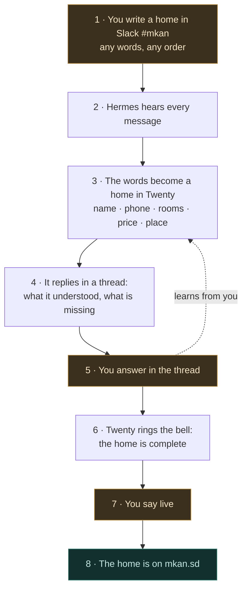

**Home** is the lane that turns a few words typed into Slack into a home for rent on
mkan.sd. The scene it is built for: you go to meet a host, sit with him, ask what you need
to know to list his places, and on the way back you type it into `#mkan` from your phone —
a name, a phone number, rooms, a price, a neighbourhood — in any order, in Arabic or
English. The channel is your field notebook; the engine does the rest. The engine reads every message in
`#mkan`, decides on its own whether it is a home, makes a record of it in the Twenty CRM,
tells you what it understood and what is still missing, and rings a bell when the home has
enough to go live. Then you say `live`, and it is on the site.

The one rule that outranks speed: **the words are yours, the record is a mirror of them,
and nothing goes live without your yes.** The engine never invents a price, a room, or a
phone number. What it did not understand it keeps as your words, verbatim, on the record —
and every correction you make teaches it your way of writing.

## How a home travels

Eight steps. You touch three of them (1, 5, 7); the rest happen on their own.



### What each box means

| Box | In plain words |
| --- | --- |
| **1 · You write a home in Slack** | One message in `#mkan`, typed after meeting the host. A name, a phone, "two rooms, a hall, a bathroom, a kitchen". No form, no order, no special word to start with. A numbered list is several homes of the same host. |
| **2 · Hermes hears every message** | The gateway on this Mac is woken by every message in the channel and runs one command. It never reads the words itself and never answers in its own voice — it is the ear, not the brain. |
| **3 · The words become a home in Twenty** | A script reads your message straight from Slack, asks Claude what it says, checks the answer against the CRM's own field list, and creates one `home` record per unit — with a code like `0005-01` once it knows the host. Your original words are kept on the record as a note. |
| **4 · It replies in a thread** | Under your message: the record link, the code, what it understood (rooms, price, place…), and what is still missing — the must-haves first. |
| **5 · You answer in the thread** | "The price is 40 thousand", "three bathrooms not two", "it is in Salalab". The record is updated; the reply says what changed. Whatever you correct becomes a test case for the next version of the reader. |
| **6 · Twenty rings the bell** | When the must-haves are all there and you have confirmed the price with the host, the record moves to the stage that means *ready*, and the thread says so. |
| **7 · You say live** | `live 0005-01` in the thread. Only a person says this — never the machine. |
| **8 · The home is on mkan.sd** | The site gets the listing with its code, Twenty is updated to match, and the thread carries the link: `mkan.sd/ar/listings/0005-01`. |

> **All eight boxes exist and are switched on** (2026-08-25). The one Slack permission Box 2
> needed was clicked the same day. What is still missing is the first real home — see
> [Progress](#progress--the-real-trace-snapshot-2026-08-25).

## The parts

Six parts. Each one does a single thing:

| Part | What it does |
| --- | --- |
| **Slack `#mkan`** | Where you write, and where you are answered. Private channel `C0BS2NZE2AY` — already the mastering cockpit, so photos and homes share one room. |
| **Hermes** | The ear. NousResearch's [hermes-agent](/docs/hermes), the `h` lane, connected to Slack over Socket Mode from this Mac. Holds a one-line skill: hear a message, run the sweep, stay silent. |
| **The script** (mkan) | The hands. `scripts/crm/home-intake.ts` — reads the message from Slack, extracts, validates, writes Twenty, writes the site on `live`, and posts every reply as the same `kun` bot. Also runs on a two-minute timer, so a home is caught even when Hermes is down. |
| **Claude** | The reader. `claude -p` on the Max plan turns your words into fields under a frozen, versioned prompt. No API key, no per-message cost. |
| **Twenty `home`** | The record. The mkan workspace already carries everything this lane needs — ~100 fields, 147 homes today. Nothing new is added to the CRM. |
| **The site** | The truth. mkan Prisma is where a listing lives; Twenty mirrors it. `live` writes the site first, then updates Twenty. |

## What you can write

You came back from a host's door with what he told you. Your own example, exactly as
you would type it:

```
1. احمد ٠٩١٢٣١٠٢٠٥ الشقة الاولي غرفتين صالة حمام مطبخ
```

reads as: host **أحمد**, phone **+249 91 231 0205** (Arabic digits are read as digits,
`09…` becomes `+249…`), home **1**: two bedrooms, a hall, one bathroom, a kitchen. The reply
asks for what is missing — the price, the neighbourhood or a map link — and offers a title.

Several homes of one host, in one message:

```
احمد ٠٩١٢٣١٠٢٠٥ — حي الثورة، قريب من المطار
1. الشقة الاولى غرفتين صالة حمام مطبخ ٣٠ الف الليلة
2. الشقة الثانية ثلاث غرف صالتين حمامين مطبخ مكيف ٤٥ الف
3. استوديو غرفة وحمام ١٥ الف
```

reads as three homes — `0005-01`, `0005-02`, `0005-03` — under the same host, all in
Al-Thawra, priced 30,000 / 45,000 / 15,000 SDG a night. The third is a studio, which the
CRM calls `ROOMS`.

In English, with a map link:

```
Fatima 0912 555 000 — villa in Salalab near the sea, 4 bedrooms 3 bathrooms,
AC, generator, 80k/night https://maps.app.goo.gl/…
```

### What gets picked out

| You write | It becomes | Needed for live? |
| --- | --- | --- |
| a phone number, in any digits | `hostPhone` as `+249…`, plus the host record | **yes** — someone to call |
| a person's name | `hostName` | expected, not required |
| 2 bedrooms · `غرفتين` | `bedrooms` | **yes** |
| 3 bathrooms · `حمامين` | `bathrooms` | **yes** |
| villa · `فيلا` · `شقة` · `استوديو` | `propertyType` | **yes** |
| 30k/night · `٣٠ الف الليلة` | `priceNightSdg` | **yes** |
| a neighbourhood · a map link | `zone` (45 Port Sudan zones) · `googleMapsUrl` | **yes** — one of the two |
| a title, a description | `titleAr`, `descriptionAr` (English mirrored later) | **yes** — drafted from the facts if you did not write them; you see the draft before `live` |
| wifi · `صالة` · `مطبخ` · `مكيف` | `highlights` · `amenities` | nice |
| sleeps 4 · `٤ اشخاص` · `سريرين` | `guestCapacity` · `beds` | nice |
| numbered lines `1.` `2.` `3.` | one home per number, same host, codes in order | identity |
| price confirmed · `السعر مؤكد` — agreed with the host in person | `priceConfirmedByHost` | part of the bell |
| anything else — generator, water tank, which floor, furnished | kept in the note on the record, never dropped | — |

Words the CRM has no field for are not thrown away and not guessed at: they stay in your
note, and if they keep appearing they earn a field or a few-shot in the next prompt version.

## The level

A home is **eligible** when it has what the site itself needs to publish a listing, plus a
phone. Photos are deliberately not required — many Port Sudan owners list without them and
the card renders the branded placeholder — so they are a gap the reply mentions, not a wall.

| Must-have | Why |
| --- | --- |
| title · description | what the guest reads |
| price per night, SDG | the site refuses to publish without one |
| property type · bedrooms · bathrooms | the site's own publish floor |
| a place: zone, and a pin or a map link | the listing needs a location row |
| host phone | someone to reach when a guest books |
| price confirmed with the host | your word, not the machine's — you agreed it at his door and say so in the thread |

Nice to have — each one lifts the record's score: photos (three or more), beds, guests,
five or more amenities, the English mirror of the copy.

The score is the CRM's existing `dataCompletenessPct` — ten core fields, computed by the same
rubric the trust scorer uses (`scripts/crm/trust-score.ts`), so no two scripts ever disagree
about a home's number. The bell is an existing stage, not a new word: when every must-have is
present, the record moves `VETTING → CLAIMED` (*"host confirmed pricing and rules"*), and the
thread says **complete — say `live 0005-01`**. Moving the card to `CLAIMED` by hand in Twenty
rings the same bell.

## Saying live

`live 0005-01` in the thread, or `live` alone inside that home's thread. In order:

1. The script checks the home is at `CLAIMED` with every must-have present — otherwise it
   refuses and names the gap.
2. The **site** gets the listing first: the host account `0005` (created if new), the
   location row, and the listing with `code 0005-01`, published and out of draft. Nothing is
   fabricated — in particular the host's claim of the account stays empty until the host
   actually claims it, the way the funnel records it.
3. **Twenty** is updated to match: `publishState LIVE`, `pipelineStage LIVE`, the site's id and
   URL, the publish time.
4. Twenty's own webhook fires `home.updated` at the site, finds the row it just got, and
   re-confirms it — harmless, and it proves the mirror.
5. The thread carries `https://mkan.sd/ar/listings/0005-01`.

Only a person says `live`. Setting `publishState = LIVE` in Twenty by hand only touches a
listing that already exists on the site, so for a home born in Slack the word is the door.

## The code

`0005-01` is the host's account number and the unit's sequence — the same `NNNN-NN` the
whole marketplace joins on (`Listing.code` on the site, `listingId` in Twenty; see
[Mastering](/docs/master#naming-the-photos)). Accounts `0001–0004` are the four hand-verified
hosts, `1001+` the scraped ones; a new host from Slack takes the next free manual number.

**How the account is assigned, in order.** The account number is a **login slot, not a fact
about the host** — `0006` and the one shared password are what they type on mkan.sd, and the
number has nothing to do with their phone. It is simply the next free one, read across both
sides of the join at once: the `account` on every home *and* the `mkanUsername` on every host
(a host can hold a number a day before their first home carries it, and reading one side only
hands the same number out twice). `1001+` stays reserved for scraped hosts.

A known host keeps the account already written on their record; a host nobody knows gets a new
`host` record, the next free number written onto it, and codes for their homes — **whether or
not a phone was written down**. The phone stays an anchor for *recognising* a host and a
must-have before `live`, so nothing reaches the site with nobody to call; it is no longer a
gate on the numbering. A number that arrives later is written onto the host record it belongs
to, unless it turns out to belong to a host who already has an account — then the thread says
so and moves nothing, because welding two identities together on a guess is the mistake the
`same` / `new` question exists to prevent.

The site account is provisioned when the first home goes `live`, and it is **only the number**:
`0006` and the shared password are the whole of what a host is told. `User.email` is a required
unique column, so it holds the number itself — the `@mkan.org` domain that used to sit behind it
was removed on 2026-08-26 (69 accounts; `pnpm accounts:simplify`, reversible from its ledger).
`getUserByIdentifier` answers to the number, to a host's own name, and still to the old address
for anyone who types it from memory. `username` stays the host's name because that is what a
guest reads under *"Hosted by"*; `mkanUsername` and `Account provisioned` are filled on the host
record at that moment, and the CRM's `mkan account` field is legacy.

**How the code is assigned.** For a home born in Slack the **CRM mints** it the moment the
host is known — the next unit under the account, in the order the units were written (the
"first flat" in your message is not necessarily unit 01) — and the site keeps it at `live`
(`ensureListingCode` sees a code and returns). A unit that looks like a home the host already
has is not minted until you answer `new`. Known gap: the mint reads Twenty's codes but not yet
the site's, so a host who publishes a flat through the wizard in between could take the same
number; the site's unique index on `code` catches that at `live`, and the next step is to read
both sides before minting.

## It learns your way of writing

The reader is a prompt with a version number, and it improves the way the engine improves
everything else — by measurement, not by drift:

- **Every message is kept**: the words, what was read from them, which prompt version read
  them. On the record as a note, and in a local corpus.
- **Every correction is a test case.** "Three bathrooms, not two" in the thread updates the
  record *and* lands in a corrections file. `pnpm home:learn` turns corrections into
  anonymised fixtures (phones and names replaced — the repository is public), drafts the next
  prompt version with your real phrasings as examples, and runs the whole set. Only a green set
  bumps the version, and a person commits it.
- **A wrong read is visible, never silent.** The reply always shows what was understood; a
  message the reader cannot parse gets an honest *"I could not read this"* with what it saw,
  and goes into the corpus for the next version.
- **Hermes does not edit itself.** Its skill for this channel lives in the mkan repository and
  is installed from there; the gateway's curator is not allowed to rewrite it.

## Progress — the real trace (snapshot 2026-08-25)

Measured against the live CRM, gateway and Slack, not the docs:

| Part | State |
| --- | --- |
| Twenty `home` object | **exists** — 147 homes, ~100 fields, every stage and field this lane uses already defined; 33 `LIVE`, 26 `publishReady`, 129 still `HUNTED` |
| Twenty → site webhook | **registered and firing** on `home.updated` at `mk.databayt.org/api/webhooks/twenty` |
| Twenty browser UI | **back** — `mkan.databayt.org` answers 200 again |
| Hermes gateway | **running** on this Mac, Slack and webhook platforms connected since 2026-08-23 |
| `#mkan` | **exists** (private, `C0BS2NZE2AY`), the bot `kun` is a member and posts there daily |
| The bot reading `#mkan` | **unblocked 2026-08-25** — `groups:history` + `files:read` added and the app reinstalled; the probe answers `ok: true` |
| The script (Phase 1) | **built** — `home:sweep` / `extract` / `intake` / `update` / `publish` / `status` in `mkan/scripts/crm/`, 17 pure tests green |
| The ears | **live** — Hermes bound to `#mkan` (every message wakes it, `home` skill, `[SILENT]`), launchd `com.databayt.mkan-home-sweep` every 2 min, one run lock |
| The first real home | **proven 2026-08-25** — السند's two flats in one message: read right (2 bd · 1 ba · 7 beds · railway district · AC, washer, kitchen, TV, balcony; floor, iron, cooler, generator-by-agreement kept as notes), phone matched to the existing account-0004 host, matched one-to-one to `0004-02` / `0004-03` (live since 08-18), merged on `same`, **beds corrected 4→7 from the scout's words**, message attached as a note, both at 90% |

**Blocked on one small click, and only for the Hermes ear.** The read scopes were added the
same day and the timer ear carried the first real home end to end. Hermes itself never woke —
your ID is allowed and the gateway was connected, so the `message.groups` **event
subscription** is the missing piece: api.slack.com/apps → the `kun` app → *Event
Subscriptions* → Subscribe to bot events → `message.groups` → Save → Reinstall. Until then the
two-minute timer is the listener, which it has proven it can be.

### Build ledger

| Commit | What landed |
| --- | --- |
| kun `d1e9a34` · `bf431af` | This page — the lane drawn before any code; the mixed-script table made readable |
| mkan `7056c97` | The intake lane: `home:sweep` reads `#mkan` straight from Slack (cursor + thread ledger, idempotent by `ts`), `claude -p` under the frozen v1 prompt, vocabulary enforcement, host by phone, account + code minting, `home` + `host` + note, the trust rubric's own completeness, thread replies as the same bot, corrections file; the Hermes `home` skill + installer |
| mkan `5f795c3` | `live 0005-01` → `home:publish`: site first (account, location — pin or zone centre said as such —, listing with its code), then Twenty mirrors LIVE; run lock between the two ears; `FORCE_SEED` carried by both installers |
| mkan `334a7a0` | The site's Twenty webhook mints the code when a home is flipped LIVE from the CRM |
| mkan `283d7e4` · `10e7fd9` · `6374406` | Learned from the first real message: duplicates matched one-to-one and **asked** (`same 0004-02 0004-03` merges, `new` creates); the host record's own account is the truth; no phone → nothing minted; the scout's numbers win on a merge and land in the corrections file; place names (a building, a market) are address words, not leftovers; a home already on the site is told so instead of asked to go live; `home:answer` for decisions taken elsewhere |

### Next

The first `live` of a home born here (the first message described two flats that were
already on the site). Then: read the site's codes before minting; a `host 0004` hint in the
words to force a host match when the phone is new. Phase 2 — the bell from Twenty for edits made in the CRM's
own UI (a workflow on `pipelineStage → CLAIMED` posting to Hermes' webhook route, the same
shape the hogwarts funnel already runs). Phase 3 — photos posted in the thread, re-hosted on
the CDN and attached to the record so mastering picks them up by itself. Phase 4 —
`home:learn`, the gated prompt-version loop (the corrections file is already being written).

## Traps, measured

Each of these cost one real round trip on 2026-08-25; none is theoretical.

- **A host's second flat is not a duplicate of the first.** The first dedup rule (same phone,
  same rooms, same type) flagged both of السند's flats against the same record and created
  nothing — with no way to answer. Duplicates are now matched one-to-one by likeness and the
  thread asks: `same …` or `new`. The scout decides; the machine never merges on its own.
- **Stale numbers in the CRM.** `0004-02` and `0004-03` carried `beds = 4`; the scout wrote
  "سبعة سرير". On `same`, the scout's numbers win — they were at the door — and every changed
  number is written to `corrections.jsonl`, which is how the CRM got corrected instead of the
  message being bent to fit it.
- **"مشغل دبي" is an address, not a leftover.** The reader filed the building's name under
  leftover; the prompt now says building, operator, market and landmark names are place words.
- **Already live is not "say live".** The merged flats had been on mkan.sd for a week and the
  reply still offered `live`. Replies and `home:publish` now read the publish state first.
- **An ear that is connected can still be deaf.** Scopes let the bot read; only the
  `message.groups` event makes Socket Mode deliver private-channel messages. The timer ear was
  designed for exactly this gap and carried the whole first run.
- **`depth=0` hides relations.** Twenty's REST answers `noteTargets: []` at the default depth;
  the notes were attached all along. Check with `depth=1` before calling something missing.

## Decisions on record

- **No wake word.** Hermes is woken by every message in `#mkan`; the script decides what each
  one is, and stays silent on the rest.
- **Hermes hears; the script understands; the same bot answers.** The gateway model never
  touches the words, and every reply is posted by the script — so the lane also works when the
  gateway is down.
- **The reader is `claude -p` on the Max plan** — no API key, no per-message cost — under a
  frozen, versioned prompt validated against the CRM's own field list.
- **Target object is `homes`**, where the webhook, the trust rubric, mastering and the sync loop
  already live. A home born here does not appear on the Port Sudan board until mirrored.
- **No new vocabulary.** `VETTING` while gathering, `CLAIMED` when eligible, `LIVE` after the
  yes; `source = FIELD_SCOUT` — because that is what this is, a scout who met the host; Twenty's
  option lists stay untouched (they are append-only).
- **The level is the site's publish floor plus a phone**; photos are a gap, not a wall.
- **A person says `live`.** Never the machine.
- **State truth is mkan Prisma; Twenty mirrors.** The CRM mints the code when the host is known;
  the site keeps it.
- **The account number is a sequence, not a fact.** `0006` is a login slot with one shared
  password, minted in order from the whole CRM at once and written onto both the host and every
  home. It is unrelated to the phone: a host filed without a number still gets an account and
  codes, and still cannot go `live` until someone can be called. *(Reversed 2026-08-26, by
  Abdout, from the 08-25 "no phone → nothing minted".)*
- **Dedup before create.** A thread reply is always an update; a new message that matches an
  existing host phone and unit is flagged `SUSPECTED` and asked about, not duplicated.
- **Improvement is a gated loop.** Corrections become tests; a prompt version ships only green.
- **Mac-bound by nature.** Twenty and Hermes live on this laptop; the intake desk is open when
  the lid is. A message sent while it sleeps waits — the sweep cursor picks it up on wake.

## Related

- [CRM](/docs/crm) — the Twenty fork, workspaces, webhooks, and why deletes are hard
- [Mastering](/docs/master) — the sibling loop in the same channel: photos in, better photos out
- [Funnel](/docs/funnel) — mkan's activation ladder and the retention loop after `LIVE`
- [Scrape & Leads](/docs/scrape) — the other way homes reach the CRM
- [Hermes](/docs/hermes) — the gateway lane, Slack wiring, and the relay doctrine
- [Slack](/docs/slack) — the workspace, channels, and the three different Slack pipes
- [Mkan social](/docs/social/mkan) — the brand this lane feeds
