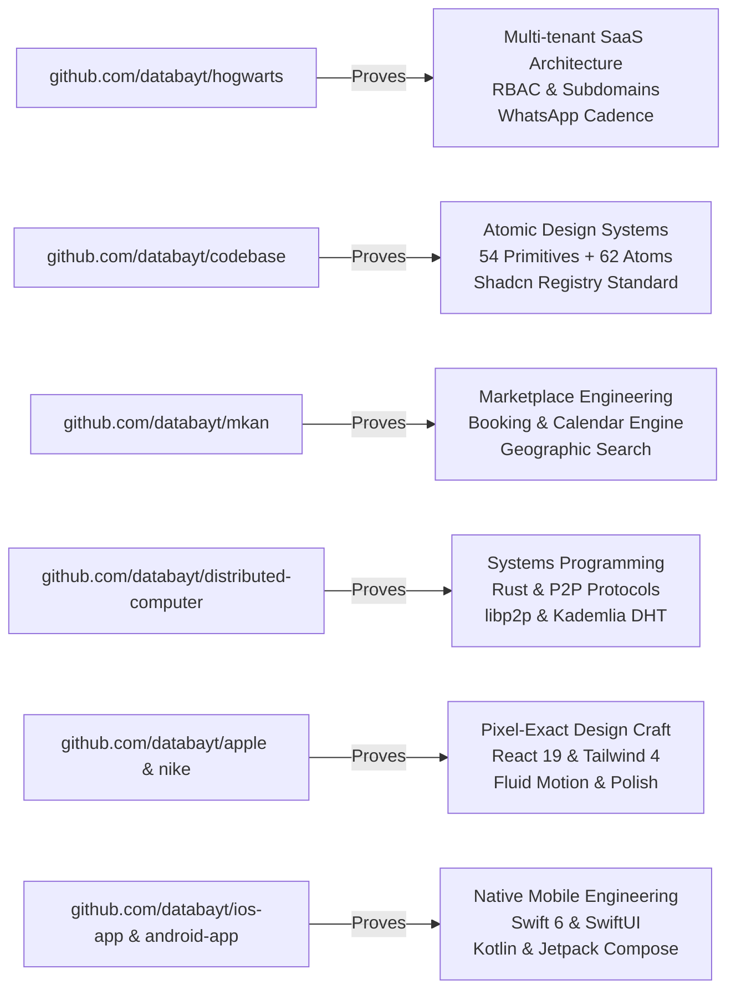
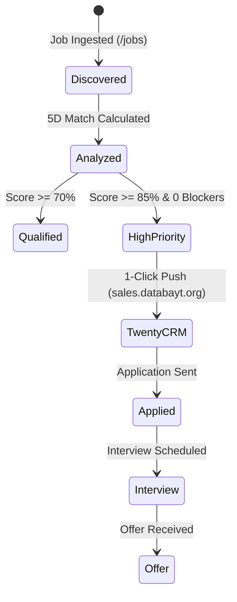

# Job Engine

> **"Evidence over keywords. Capabilities over job titles. Explainability over mysterious scores."**

The **Job Engine** is Kun's career operations and opportunity matching platform. Rather than building a naive keyword counter that matches "React" to "React" without understanding depth, the engine inspects Databayt's actual codebase on disk, builds a verified **Engineering Knowledge Profile**, normalizes incoming market opportunities, and scores candidate fit with full explainability.

```
┌─────────────────────────────────────────────────────────────────┐
│                    JOB ENGINE ARCHITECTURE                      │
├─────────────────────────────────────────────────────────────────┤
│                                                                 │
│  Layer 5: Operations & Decision Layer                           │
│  ┌────────────────────────────────────────────────────────────┐ │
│  │ Kun Jobs Hub (/jobs) │ Profile Dossier │ Twenty CRM Sync   │ │
│  │ Human Review Queue   │ Application Assets (Cover, DM, STAR)│ │
│  └────────────────────────────────────────────────────────────┘ │
│                               ▲                                 │
│                               │                                 │
│  Layer 4: Opportunity & Strategy Intelligence                   │
│  ┌────────────────────────────────────────────────────────────┐ │
│  │ Problem-Based Matcher │ Builder Fit (0-to-1 Ownership)     │ │
│  │ Application Readiness │ Truthful Career Narrative          │ │
│  └────────────────────────────────────────────────────────────┘ │
│                               ▲                                 │
│                               │                                 │
│  Layer 3: 5D Explainable Matching & Normalization Engine        │
│  ┌────────────────────────────────────────────────────────────┐ │
│  │ AI Normalizer (Gemini 2.5) │ 5D Explainable Matcher        │ │
│  │ 3-Tier Blocker Classifier  │ Golden Dataset Validations    │ │
│  └────────────────────────────────────────────────────────────┘ │
│                               ▲                                 │
│                               │                                 │
│  Layer 2: 3-Layer Engineering Knowledge Profile                 │
│  ┌────────────────────────────────────────────────────────────┐ │
│  │ Layer C: Market Positioning (Full-Stack AI, Founding, SaaS)│ │
│  │ Layer B: Capability Inferences (with explicit reasoning)   │ │
│  │ Layer A: Observable Facts (Deep Production vs Manifests)   │ │
│  └────────────────────────────────────────────────────────────┘ │
│                               ▲                                 │
│                               │                                 │
│  Layer 1: Canonical Evidence Base (github.com/databayt)         │
│  ┌────────────────────────────────────────────────────────────┐ │
│  │ GitHub Deep Reader (Schemas, Manifests, Remote AST Trees)  │ │
│  │ Local Disk Fast-Path (AST / Server Actions Acceleration)   │ │
│  └────────────────────────────────────────────────────────────┘ │
│                                                                 │
└─────────────────────────────────────────────────────────────────┘
```

---

## 1. The Core Philosophy

Traditional job boards and candidate matching systems fail in two symmetric ways:
1. **Keyword Overlap Hallucination**: A developer who wrote a 10-line tutorial in `Go` is scored identically to someone who built distributed P2P protocols in `Rust`.
2. **Title Inelasticity**: Someone who built and shipped complete multi-tenant SaaS products (Hogwarts) is considered unqualified for "Full-Stack AI Engineer", "Founding Engineer", or "Product Engineer" simply because their previous title did not contain the exact buzzwords.

The Kun Job Engine solves this by anchoring every evaluation in **verifiable repository evidence**:

| Principle | Traditional Approach | Kun Job Engine |
| :--- | :--- | :--- |
| **Grounding** | Self-reported resume keywords | Scanned AST, Prisma schemas, Server Actions, and Git commits |
| **Matching** | Keyword string overlap % | 5D Match + Problem-Based Solution Matching |
| **Builder Fit** | Assumes narrow specialization | Evaluates 0-to-1 build scope, product agency, and full-stack ownership |
| **Output** | Opaque numerical rank | Explainable report with positive/negative contributions & talking points |
| **Positioning** | Title buzzword inflation | Truthful narrative (EE foundations -> product builder) |
| **Action** | Disconnected job bookmarking | Integrated 1-click push to Twenty CRM (`sales.databayt.org`) |

---

## 2. Canonical Evidence Base (github.com/databayt)

The engine inspects the repositories owned and maintained by Databayt directly from **`github.com/databayt`** with local AST acceleration:



### Verified Code Evidence Matrix

```text
1. Multi-Tenant SaaS Architecture:
   - hogwarts/prisma/schema.prisma → 30+ relational models with schoolId isolation
   - hogwarts/src/auth.ts → NextAuth v5 session callbacks, role-based guards, scrypt hashing
   - hogwarts/src/lib/whatsapp/ → Outbound messaging cadence via Evolution API
   - hogwarts/scripts/crm/twenty-rest.ts → Throttled Twenty CRM REST client

2. Design Systems & Frontend Craft:
   - codebase/src/components/ → 54 UI primitives, 62 compound atoms, 31 templates
   - apple/src/app/ → Pixel-exact high-fidelity Apple design implementation in Next.js 16
   - mkan/src/components/search/ → Interactive calendar & property filters

3. AI Integration & Workflow Automation:
   - kun/src/lib/google-draft.ts → Gemini 2.5 structured schema generation with Zod
   - kun/.claude/agents/ → 28 autonomous stack agents with persistent memory
   - kun/scripts/crawl-anthropic/ → Automated web crawler & structural snapshotting

4. Systems & Native Mobile:
   - distributed-computer/crates/ → Rust multi-crate workspace, libp2p, Kademlia DHT
   - ios-app/Sources/ → Swift 6, SwiftUI, iOS 18+, MVVM, offline sync
   - android-app/app/ → Kotlin, Jetpack Compose, bilingual LTR/RTL
```

---

## 3. The 5-Dimensional Matching Algorithm

Every ingested job posting is evaluated across five distinct dimensions:

```text
Overall Score = 0.40 * Tech + 0.30 * Capability + 0.15 * Domain + 0.15 * Seniority - BlockerPenalty
```

```
┌─────────────────────────────────────────────────────────────────┐
│                     5D MATCHING BREAKDOWN                       │
├─────────────────────────────────────────────────────────────────┤
│                                                                 │
│  1. Technical Match (40% Weight)                                │
│     Direct alignment with verified production stack             │
│     (Next.js, TypeScript, React, Prisma, PostgreSQL, AI SDKs).  │
│                                                                 │
│  2. Capability & Scope Match (30% Weight)                       │
│     Architectural breadth proven in complete products           │
│     (Multi-tenancy, Auth, Design Systems, Mobile, Pipelines).   │
│                                                                 │
│  3. Product Domain Match (15% Weight)                           │
│     Domain familiarity (SaaS, EdTech, Marketplaces, DevTools). │
│                                                                 │
│  4. Seniority & Realism Match (15% Weight)                      │
│     Realistic fit for a product builder and systems engineer.   │
│                                                                 │
│  5. Critical Blocker Penalty                                    │
│     Detects hard blockers (e.g. bare-metal C++ graphics) vs     │
│     easily learnable nice-to-haves (e.g. unfamiliar cloud SDK). │
│                                                                 │
└─────────────────────────────────────────────────────────────────┘
```

### Recommendation Tiers

| Tier | Score Range | Meaning | Action |
| :--- | :--- | :--- | :--- |
| **High Priority** | >= 85% (0 blockers) | Perfect alignment with demonstrated builder capabilities | Push to CRM immediately & tailor application |
| **Strong Fit** | 70% - 84% | Strong foundation; minor secondary gaps easily bridged | Prepare portfolio links and apply |
| **Prepare & Apply** | 55% - 69% | Valid match but requires targeted interview prep on gaps | Review risk points before proceeding |
| **Low Probability** | < 55% or >= 2 blockers | Fundamental mismatch in core stack or domain | Skip or archive |

---

## 4. Normalization Engine

Jobs arrive from diverse sources (pasted text, job boards, scrapers). The normalizer cleans raw input into a strict Zod-validated model using **Google Gemini 2.5 Flash** (`@ai-sdk/google` + `generateObject`):

```typescript
export interface NormalizedJobInput {
  title: string;
  company: string;
  companyUrl?: string;
  location?: string;
  remoteType: "remote" | "hybrid" | "onsite";
  employmentType: "full_time" | "part_time" | "contract" | "freelance";
  salary?: string;
  description: string;
  responsibilities: string[];
  requiredSkills: string[];     // Must-have requirements
  preferredSkills: string[];    // Nice-to-have bonuses
  seniority?: string;
  domain?: string;
  sourceUrl?: string;
  source?: string;
}
```

If the AI API key is not configured, the normalizer falls back to a deterministic heuristic parser, guaranteeing 100% offline availability.

---

## 5. Twenty CRM Integration

Qualified opportunities are pushed directly into Databayt's self-hosted **Twenty CRM** instance:

| Property | Value |
| :--- | :--- |
| **Target Workspace** | **Databayt** (`sales.databayt.org`) |
| **Target Pipeline** | *Tech jobs, software house partnerships, client custom software* |
| **Local Endpoint** | `http://localhost:3100/rest/opportunities` |
| **Auth Key** | macOS Keychain: `security find-generic-password -s databayt-twenty -a databayt` |
| **Throttling** | >= 700ms spacing, exponential backoff on 429 |

### Ingestion Lifecycle



---

## 6. Interview Preparation Loop

When a high-priority opportunity is reviewed, the engine automatically compiles **Evidence-Grounded Talking Points**:

```text
Example Assessment Output:
--------------------------------------------------------------------------------
Role: Senior Full-Stack AI Engineer @ ScaleAI Labs
Overall Match: 92% (High Priority)

Strongest Evidence:
• Hogwarts: Shipped end-to-end multi-tenant education SaaS with PostgreSQL,
  NextAuth v5, and Evolution API WhatsApp automation.
• Codebase: Built canonical atomic design registry with 54 UI primitives and
  62 compound atoms adhering to strict Shadcn/UI standards.
• Kun: Engineered AI workflow engine with Vercel AI SDK, Google Gemini 2.5
  structured schema generation, and Prisma 7 driver adapters.

Talking Points for Interview:
1. "In Hogwarts, I architected a multi-tenant PostgreSQL schema supporting student/teacher
   isolation and automated outbound WhatsApp workflows via Evolution API."
2. "I treat frontend with extreme craft, having built a 150+ component Shadcn registry in
   Codebase and pixel-exact React 19 clones in Apple R&D."
3. "My AI engineering experience centers on structured, reliable LLM output pipelines using
   Zod schemas and error boundaries rather than fragile free-text prompts."
```

---

## 7. Developer Runbook & Verification

### Running the Engine Locally

```bash
# 1. Typecheck the entire engine
pnpm typecheck

# 2. Run unit & integration tests
pnpm test src/lib/jobs/__tests__/job-engine.test.ts

# 3. Push Prisma schema changes to database
npx prisma db push

# 4. Start local development server
pnpm dev
```

### Route Map

- **`/jobs`**: Interactive Hub with live intake form, sample job preset loader, filter tabs, stats overview, and expandable opportunity cards.
- **`/jobs/profile`**: Dedicated dossier view of the candidate's verified Engineering Knowledge Profile with active repositories and proven capabilities.
- **`/docs/jobs`**: This architecture manual.
