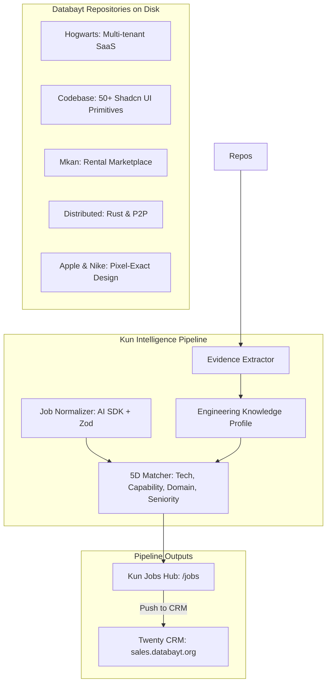

# Job Intelligence Engine (Phase 1)

The **Job Intelligence Engine** is Kun's evidence-grounded career intelligence subsystem. Rather than performing superficial keyword matching, it inspects Databayt's actual codebase on disk, builds a verified **Engineering Knowledge Profile**, normalizes incoming market opportunities, and scores candidate fit with full explainability.

## Core Tenets

1. **Evidence over keywords** — Finding `next` in `package.json` is weak; complex App Router architectures, multi-tenant isolation, NextAuth RBAC, and server actions are proof.
2. **Capabilities over job titles** — Highlighting generalist ability to architect and ship end-to-end products from scratch (Hogwarts, Mkan, Codebase).
3. **Transparent explainability** — Every match produces a detailed five-dimensional breakdown with concrete code references, critical blockers, and interview talking points.
4. **Zero exaggeration** — Strictly grounded positioning derived from verified repository assets.

---

## Architecture

---

## 5-Dimensional Match Scoring

| Dimension | Weight | Meaning |
| :--- | :--- | :--- |
| **Technical Match** | 40% | Direct alignment with verified production stack (TypeScript, Next.js, React, Prisma, PostgreSQL, AI SDKs). |
| **Capability Match** | 30% | Architecture and scope alignment (Multi-tenant SaaS, Auth, Design Systems, Mobile, Scraping). |
| **Domain Match** | 15% | Product domain familiarity (SaaS, EdTech, Marketplaces, DevTools, FinTech). |
| **Seniority Realism** | 15% | Realistic attainability for a product builder and system engineer. |

---

## Twenty CRM Integration

Qualified opportunities (overall score $\ge 80\%$) can be synced directly to Databayt's Twenty CRM workspace at **[`sales.databayt.org`](https://sales.databayt.org)** via the throttled REST client on port 3100 or through Keychain credentials (`databayt-twenty`).
