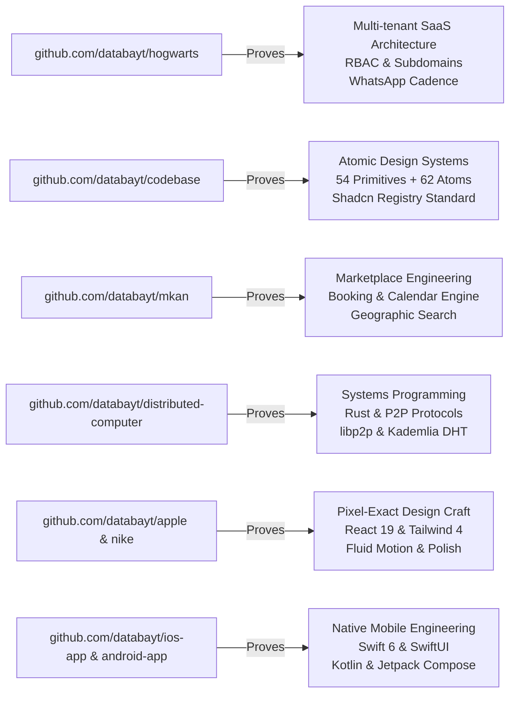
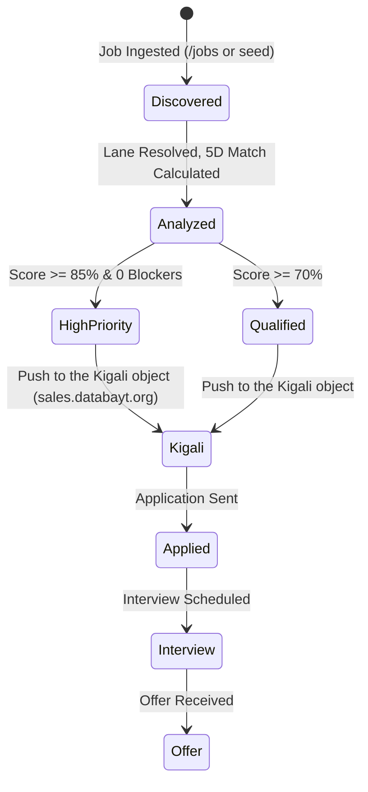
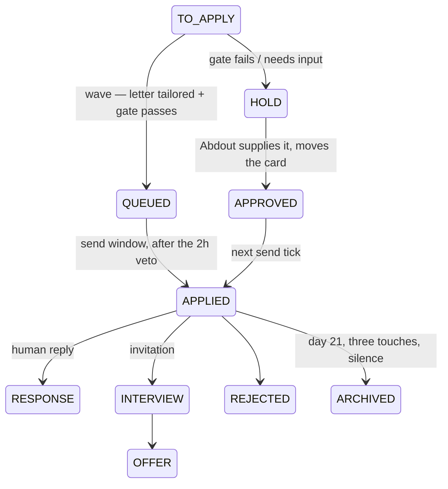

# Job Engine

> **"Evidence over keywords. Capabilities over job titles. Explainability over mysterious scores."**

The **Job Engine** is Kun's career operations and opportunity matching platform. Rather than building a naive keyword counter that matches "React" to "React" without understanding depth, the engine inspects Databayt's actual codebase on disk, builds a verified **Engineering Knowledge Profile**, normalizes incoming market opportunities, and scores candidate fit with full explainability.

```
┌─────────────────────────────────────────────────────────────────┐
│                    JOB ENGINE ARCHITECTURE                      │
├─────────────────────────────────────────────────────────────────┤
│                                                                 │
│  Layer 5: Operations & Decision Layer                           │
│  ┌────────────────────────────────────────────────────────────┐ │
│  │ Kun Jobs Hub (/jobs) │ Profile Dossier │ Twenty CRM Sync   │ │
│  │ Human Review Queue   │ Application Assets (Cover, DM, STAR)│ │
│  └────────────────────────────────────────────────────────────┘ │
│                               ▲                                 │
│                               │                                 │
│  Layer 4: Opportunity & Strategy Intelligence                   │
│  ┌────────────────────────────────────────────────────────────┐ │
│  │ Problem-Based Matcher │ Builder Fit (0-to-1 Ownership)     │ │
│  │ Application Readiness │ Truthful Career Narrative          │ │
│  └────────────────────────────────────────────────────────────┘ │
│                               ▲                                 │
│                               │                                 │
│  Layer 3: 5D Explainable Matching & Normalization Engine        │
│  ┌────────────────────────────────────────────────────────────┐ │
│  │ AI Normalizer (Gemini 2.5) │ 5D Explainable Matcher        │ │
│  │ 3-Tier Blocker Classifier  │ Golden Dataset Validations    │ │
│  └────────────────────────────────────────────────────────────┘ │
│                               ▲                                 │
│                               │                                 │
│  Layer 2: 3-Layer Engineering Knowledge Profile                 │
│  ┌────────────────────────────────────────────────────────────┐ │
│  │ Layer C: Market Positioning (Software · Protection · ETO)  │ │
│  │ Layer B: Capability Inferences (with explicit reasoning)   │ │
│  │ Layer A: Observable Facts (Deep Production vs Manifests)   │ │
│  └────────────────────────────────────────────────────────────┘ │
│                               ▲                                 │
│                               │                                 │
│  Layer 1: Canonical Evidence Base (two channels)                │
│  ┌────────────────────────────────────────────────────────────┐ │
│  │ GitHub Deep Reader (Schemas, Manifests, Remote AST Trees)  │ │
│  │ Local Disk Fast-Path (AST / Server Actions Acceleration)   │ │
│  │ CV Channel (protection & marine record — sourceType manual)│ │
│  └────────────────────────────────────────────────────────────┘ │
│                                                                 │
└─────────────────────────────────────────────────────────────────┘
```

---

## 1. The Core Philosophy

Traditional job boards and candidate matching systems fail in two symmetric ways:
1. **Keyword Overlap Hallucination**: A developer who wrote a 10-line tutorial in `Go` is scored identically to someone who built distributed P2P protocols in `Rust`.
2. **Title Inelasticity**: Someone who built and shipped complete multi-tenant SaaS products (Hogwarts) is considered unqualified for "Full-Stack AI Engineer", "Founding Engineer", or "Product Engineer" simply because their previous title did not contain the exact buzzwords.

The Kun Job Engine solves this by anchoring every evaluation in **verifiable repository evidence**:

| Principle | Traditional Approach | Kun Job Engine |
| :--- | :--- | :--- |
| **Grounding** | Self-reported resume keywords | Scanned AST, Prisma schemas, Server Actions, and Git commits |
| **Matching** | Keyword string overlap % | 5D Match + Problem-Based Solution Matching |
| **Builder Fit** | Assumes narrow specialization | Evaluates 0-to-1 build scope, product agency, and full-stack ownership |
| **Output** | Opaque numerical rank | Explainable report with positive/negative contributions & talking points |
| **Positioning** | Title buzzword inflation | Truthful narrative (EE foundations -> product builder) |
| **Action** | Disconnected job bookmarking | Integrated 1-click push to Twenty CRM (`sales.databayt.org`) |

---

## 2. Canonical Evidence Base (github.com/databayt)

The engine inspects the repositories owned and maintained by Databayt directly from **`github.com/databayt`** with local AST acceleration:


```mermaid
graph LR
    HOGWARTS["github.com/databayt/hogwarts"] -->|Proves| SAAS["Multi-tenant SaaS Architecture\nRBAC & Subdomains\nWhatsApp Cadence"]
    CODEBASE["github.com/databayt/codebase"] -->|Proves| UI["Atomic Design Systems\n54 Primitives + 62 Atoms\nShadcn Registry Standard"]
    MKAN["github.com/databayt/mkan"] -->|Proves| MKT["Marketplace Engineering\nBooking & Calendar Engine\nGeographic Search"]
    DISTRIBUTED["github.com/databayt/distributed-computer"] -->|Proves| SYS["Systems Programming\nRust & P2P Protocols\nlibp2p & Kademlia DHT"]
    APPLE["github.com/databayt/apple & nike"] -->|Proves| CRAFT["Pixel-Exact Design Craft\nReact 19 & Tailwind 4\nFluid Motion & Polish"]
    MOBILE["github.com/databayt/ios-app & android-app"] -->|Proves| MOB["Native Mobile Engineering\nSwift 6 & SwiftUI\nKotlin & Jetpack Compose"]
```

### The CV Channel

Repository scanning can only ever prove software: a commissioning report is not
a `package.json`. Twelve years of electrical and marine engineering therefore
entered the profile nowhere. `src/lib/jobs/cv-evidence.ts` is the second
channel — `EvidenceFact`, `CapabilityInference`, `MarketPositioningRole` and
`TechnologySkillFact` entries carrying `sourceType: "manual"`, merged in
`buildEvidenceKnowledgeProfile()` and sourced from `jobs/cv/`.

Technology **names in that file are load-bearing**. The matcher tests
`t.includes(req) || req.includes(t.split(" ")[0])`, so each name's first word is
a live wildcard: a name containing "maintenance" would swallow the bare required
skill `"AI"`, and one starting "Systems" or "Embedded" would neutralise the hard
blockers the bare-metal golden scenarios depend on.

### Verified Code Evidence Matrix

```text
1. Multi-Tenant SaaS Architecture:
   - hogwarts/prisma/schema.prisma → 30+ relational models with schoolId isolation
   - hogwarts/src/auth.ts → NextAuth v5 session callbacks, role-based guards, scrypt hashing
   - hogwarts/src/lib/whatsapp/ → Outbound messaging cadence via Evolution API
   - hogwarts/scripts/crm/twenty-rest.ts → Throttled Twenty CRM REST client

2. Design Systems & Frontend Craft:
   - codebase/src/components/ → 54 UI primitives, 62 compound atoms, 31 templates
   - apple/src/app/ → Pixel-exact high-fidelity Apple design implementation in Next.js 16
   - mkan/src/components/search/ → Interactive calendar & property filters

3. AI Integration & Workflow Automation:
   - kun/src/lib/google-draft.ts → Gemini 2.5 structured schema generation with Zod
   - kun/.claude/agents/ → 28 autonomous stack agents with persistent memory
   - kun/scripts/crawl-anthropic/ → Automated web crawler & structural snapshotting

4. Systems & Native Mobile:
   - distributed-computer/crates/ → Rust multi-crate workspace, libp2p, Kademlia DHT
   - ios-app/Sources/ → Swift 6, SwiftUI, iOS 18+, MVVM, offline sync
   - android-app/app/ → Kotlin, Jetpack Compose, bilingual LTR/RTL
```

---

## 3. The 5-Dimensional Matching Algorithm

Every ingested job posting is evaluated across five distinct dimensions:

```text
Overall Score = 0.40 * Tech + 0.30 * Capability + 0.15 * Domain + 0.15 * Seniority - BlockerPenalty
```

```
┌─────────────────────────────────────────────────────────────────┐
│                     5D MATCHING BREAKDOWN                       │
├─────────────────────────────────────────────────────────────────┤
│                                                                 │
│  1. Technical Match (40% Weight)                                │
│     Direct alignment with verified production stack             │
│     (Next.js, TypeScript, React, Prisma, PostgreSQL, AI SDKs).  │
│                                                                 │
│  2. Capability & Scope Match (30% Weight)                       │
│     Architectural breadth proven in complete products           │
│     (Multi-tenancy, Auth, Design Systems, Mobile, Pipelines).   │
│                                                                 │
│  3. Product Domain Match (15% Weight)                           │
│     Domain familiarity (SaaS, EdTech, Marketplaces, DevTools). │
│                                                                 │
│  4. Seniority & Realism Match (15% Weight)                      │
│     Realistic fit for a product builder and systems engineer.   │
│                                                                 │
│  5. Critical Blocker Penalty                                    │
│     Detects hard blockers (e.g. bare-metal C++ graphics) vs     │
│     easily learnable nice-to-haves (e.g. unfamiliar cloud SDK). │
│                                                                 │
└─────────────────────────────────────────────────────────────────┘
```

### Engineering Lanes

The four dimensions above are not scored the same way for every job, because the
candidate is not one professional. A 33 kV substation posting and a Next.js
posting need different verified stacks, different blocker ladders and different
domain vocabularies — scored on one software-shaped ruler, the substation job
came out at **48%, "Low Probability"**, which was the engine's single worst
answer.

`src/lib/jobs/lanes.ts` resolves each job into one of four lanes and supplies
the four literals the matcher used to hardcode:

| Lane | Verified stack | Evidence behind it |
| :--- | :--- | :--- |
| `software` | 9 repository technologies | github.com/databayt — Hogwarts, Kun, Codebase, Mkan |
| `protection` | Power Systems · Industrial & Plant | SEC / SWCC / EEIC 33/13.8 kV, OMICRON + Megger bench |
| `electrical` | Power Systems · Industrial & Plant | S-CHEM MCC and busbar, KAP C2 cable diagnostics |
| `marine` | Marine · Power Systems · Industrial & Plant | ETO across four shipping lines, 2014–2021, STCW |

Resolution scores lane keywords across title (×3), domain (×2) and required
skills (×1), and **defaults to `software`**. Two rules keep the software lane
exactly where it was: lane keywords must be specific — never bare `systems`,
which `Embedded Systems` and `Defense Systems` would trip — and the technology
categories partition, so a software job never sees a protection relay in its
verified stack. Both were load-bearing in practice: an early keyword list
included bare `ship`, and "Partner**ship**s" routed a developer-network record
into the marine lane.

### Recommendation Tiers

| Tier | Score Range | Meaning | Action |
| :--- | :--- | :--- | :--- |
| **High Priority** | >= 85% (0 blockers) | Perfect alignment with demonstrated builder capabilities | Push to CRM immediately & tailor application |
| **Strong Fit** | 70% - 84% | Strong foundation; minor secondary gaps easily bridged | Prepare portfolio links and apply |
| **Prepare & Apply** | 55% - 69% | Valid match but requires targeted interview prep on gaps | Review risk points before proceeding |
| **Low Probability** | < 55% or >= 2 blockers | Fundamental mismatch in core stack or domain | Skip or archive |

---

## 4. Normalization Engine

Jobs arrive from diverse sources (pasted text, job boards, scrapers). The normalizer cleans raw input into a strict Zod-validated model using **Google Gemini 2.5 Flash** (`@ai-sdk/google` + `generateObject`):

```typescript
export interface NormalizedJobInput {
  title: string;
  company: string;
  companyUrl?: string;
  location?: string;
  remoteType: "remote" | "hybrid" | "onsite";
  employmentType: "full_time" | "part_time" | "contract" | "freelance";
  salary?: string;
  description: string;
  responsibilities: string[];
  requiredSkills: string[];     // Must-have requirements
  preferredSkills: string[];    // Nice-to-have bonuses
  seniority?: string;
  domain?: string;
  sourceUrl?: string;
  source?: string;
}
```

If the AI API key is not configured, the normalizer falls back to a deterministic heuristic parser, guaranteeing 100% offline availability.

---

## 5. Twenty CRM Integration

Qualified opportunities are pushed directly into Databayt's self-hosted **Twenty CRM** instance:

| Property | Value |
| :--- | :--- |
| **Target Workspace** | **Databayt** (`sales.databayt.org`) |
| **Target Object** | **Jobs & Opportunities** (custom object — API name `kigaliOpportunity`, kept so callers keep working) |
| **Local Endpoint** | `http://localhost:3100/rest/kigaliOpportunities` |
| **Auth Key** | macOS Keychain: `security find-generic-password -s databayt-twenty -a databayt` |
| **Throttling** | >= 700ms spacing, exponential backoff on 429 |

### Ingestion Lifecycle


```mermaid
stateDiagram-v2
    [*] --> Discovered: Job Ingested (/jobs or seed)
    Discovered --> Analyzed: Lane Resolved, 5D Match Calculated
    Analyzed --> Qualified: Score >= 70%
    Analyzed --> HighPriority: Score >= 85% & 0 Blockers
    HighPriority --> Kigali: Push to the Kigali object (sales.databayt.org)
    Qualified --> Kigali: Push to the Kigali object
    Kigali --> Applied: Application Sent
    Applied --> Interview: Interview Scheduled
    Interview --> Offer: Offer Received
```

---

## 6. Interview Preparation Loop

When a high-priority opportunity is reviewed, the engine automatically compiles **Evidence-Grounded Talking Points**:

```text
Example Assessment Output:
--------------------------------------------------------------------------------
Role: Senior Full-Stack AI Engineer @ ScaleAI Labs
Overall Match: 92% (High Priority)

Strongest Evidence:
• Hogwarts: Shipped end-to-end multi-tenant education SaaS with PostgreSQL,
  NextAuth v5, and Evolution API WhatsApp automation.
• Codebase: Built canonical atomic design registry with 54 UI primitives and
  62 compound atoms adhering to strict Shadcn/UI standards.
• Kun: Engineered AI workflow engine with Vercel AI SDK, Google Gemini 2.5
  structured schema generation, and Prisma 7 driver adapters.

Talking Points for Interview:
1. "In Hogwarts, I architected a multi-tenant PostgreSQL schema supporting student/teacher
   isolation and automated outbound WhatsApp workflows via Evolution API."
2. "I treat frontend with extreme craft, having built a 150+ component Shadcn registry in
   Codebase and pixel-exact React 19 clones in Apple R&D."
3. "My AI engineering experience centers on structured, reliable LLM output pipelines using
   Zod schemas and error boundaries rather than fragile free-text prompts."
```

---

## 7. Developer Runbook & Verification

### Running the Engine Locally

```bash
# 1. Typecheck the entire engine
pnpm typecheck

# 2. Run unit & integration tests
pnpm test src/lib/jobs/__tests__/job-engine.test.ts

# 3. Seed the staged campaign records (idempotent by fingerprint)
pnpm db:seed:jobs --dry-run   # review first — Neon is shared prod + local
pnpm db:seed:jobs

# 4. Score any record set against the current profile (regression instrument)
pnpm dlx tsx scripts/score-report.ts --golden
pnpm dlx tsx scripts/score-report.ts jobs/kigali-jobs.normalized.json

# 5. CRM: create the Kigali object, then push (both idempotent, both --dry-run)
node scripts/crm-kigali-object.mjs --dry-run
node jobs/push-kigali-to-twenty.mjs --probe

# 6. Start local development server
pnpm dev
```

### Route Map

- **`/jobs`**: Interactive Hub with live intake form, sample job preset loader, filter tabs, stats overview, and expandable opportunity cards.
- **`/jobs/profile`**: Dedicated dossier view of the candidate's verified Engineering Knowledge Profile with active repositories and proven capabilities.
- **`/docs/jobs`**: This architecture manual.

---

## 8. The Income Loop — scrape → apply → update

Added 2026-09-26. The engine above scores; this loop is what turns scores into applications. **The
measured bottleneck is applying, not finding**: on 26 Sep all 26 board records had sat at `TO_APPLY`
for a month. Say **`jobs`** in a session (or `وظائف`) and the `jobs` skill runs the loop.

### Lanes (campaign → CRM `campaign`)

| Band | Campaign | CRM option |
| :--- | :--- | :--- |
| 1 — Rwanda | `kigali-protection-engineer` · `kigali-electrical-engineer` · `kivu-marine-eto` · `kigali-web-developer` | PROTECTION · ELECTRICAL · MARINE_ETO · WEB_DEVELOPER |
| 1 — Rwanda | `rwanda-tenders-databayt` | TENDER |
| 2 — remote income | `remote-web-developer-worldwide` · `ai-training-gigs` · `freelance-contracts` | REMOTE_WORLDWIDE · AI_TRAINING · FREELANCE |
| 3 — abroad | `engineering-contracts` | ENGINEERING_CONTRACT |

**The sea lane (since 2026-10-05).** `kivu-marine-eto` is worldwide now. Work
on board has no country, so the market gates do not apply: the Gulf
remote-only rule is about living there, not about sailing past it. The board
files these jobs under country **At sea**. The lane only takes electrical work
on board: an ETO / electro-technical title, or an electrical word next to a
vessel word. Teaching posts and mechanical posts that are not also electrical
are dropped from every lane. There are two sources:

- **Martide** (`--source martide`) lists seagoing ETO contracts with joining
  date, vessel, contract length and visa. A posting with a nationality list
  that leaves out Sudan is dropped. You apply through your Martide seafarer
  profile, so the channel is `PLATFORM`.
- **Rigzone** (`--source rigzone`) lists offshore electrical roles. The card
  must say offshore or name a floating unit. US-nationals-only and
  work-authorisation bars are dropped. It throttles a burst with an empty
  HTTP 202, so it gets two searches a day and reports a throttle as a throttle.

### Commands

```bash
pnpm jobs:discover                 # jobinrwanda, greatrwandajobs, REG, RemoteOK → jobs/inbox/<date>-discover.json
pnpm jobs:discover --source reg --limit 1   # test one adapter on one row first
pnpm jobs:ingest --dry-run         # score, drop expired / nationals-only / low auto finds
pnpm jobs:ingest                   # write Neon + push new rows to the board (idempotent)
pnpm jobs:queue                    # TO_APPLY ranked band → deadline → score
pnpm jobs:queue --stale            # APPLIED with no movement ≥ 7 days → follow up
pnpm jobs:queue --summary          # lane × status
pnpm jobs:mark <crm-id> applied    # board + Neon move together; add a note as extra args
bash scripts/jobs/daily.sh --status   # launchd, 07:00 Kigali, zero tokens
```

- **Apply is drafts only.** Email applications become Gmail drafts (the connector's account), portal
  applications become `jobs/packets/*.md`. Nothing is sent or submitted by the engine.
- **Connector lanes run in-session.** Indeed and Gmail are claude.ai connectors and are absent in
  headless `claude -p`, so the daily run covers only plain-fetch boards.
- **Not automated:** rwandajob.com and We Work Remotely block bots; ReliefWeb's API needs an approved
  `appname` (403 without one).
- **Status drift (kun#152):** prod Neon's `JobOpportunityStatus` enum holds 9 of the schema's 18 values.
  `jobs:mark` stores the nearest accepted value; the board keeps the precise status.

---

## 9. The Self-Running Loop (since 2026-09-27)

Abdout chose **auto-send with a daily cap**: email applications that pass the send gate go out on
their own from `osmanabdout@hotmail.com` through macOS Mail.app, with the lane's CV attached. Portals,
platform sign-ups, tenders and marketplace bids stay packets he submits. The board is the control
surface; Hermes carries the digest and alerts; learning proposes, Abdout adopts.


```mermaid
stateDiagram-v2
    TO_APPLY --> QUEUED: wave — letter tailored + gate passes
    TO_APPLY --> HOLD: gate fails / needs input
    HOLD --> APPROVED: Abdout supplies it, moves the card
    QUEUED --> APPLIED: send window, after the 2h veto
    APPROVED --> APPLIED: next send tick
    APPLIED --> RESPONSE: human reply
    APPLIED --> INTERVIEW: invitation
    APPLIED --> REJECTED
    APPLIED --> ARCHIVED: day 21, three touches, silence
    INTERVIEW --> OFFER
```

| Step | Script | Clock (Kigali) |
| :--- | :--- | :--- |
| Fetch — 7 adapters (jobinrwanda, greatrwandajobs, REG, RemoteOK, Remotive, Himalayas, Mercor) | `pnpm jobs:discover` → `jobs:ingest` | ≥07:00 daily |
| Wave — `claude -p` tailors from lane templates + `jobs/facts.json`, gate decides | `pnpm jobs:wave` | ≥07:00 Mon–Fri |
| Digest — the wave, the holds, deadlines ≤72h | `pnpm jobs:digest --send` (`hermes send`) | after the wave |
| Send — Mail.app, cap 5/day → 10 after 11 Oct, 1 per company | `pnpm jobs:send --apply` | 10:00–17:00 Mon–Fri |
| Replies — hotmail read locally, rules-first classifier | `pnpm jobs:inbox` | every tick 08–22 |
| Follow-ups — templated day 7 / 14, archive day 21 | `pnpm jobs:followup --apply` | ≥16:00 Mon–Fri |
| Learn — outcomes by variant / lane / wave, ≤2 inactive proposals | `pnpm jobs:learn --propose --send` | Fri ≥17:00 |

- **Heartbeat:** `scripts/jobs/loop.sh` under launchd `com.databayt.jobs-loop`, every 30 min, per-day
  stamps in `jobs/.state/` so a Mac that slept catches up. `pnpm jobs:loop --status | --pause | --resume`.
- **The send gate** (`src/lib/jobs/send-gate.ts`, tested) replaces the human reader: placeholders,
  length, company + role named, every number backed by the CVs or the posting, recipient present on the
  posting, deadline, 30-day no-repeat, CV 1–2 pages; a posting that asks for a salary figure, certified
  copies, a form, references or ID → HOLD with the reason.
- **Variants:** `jobs/variants.json` (CV + letter + follow-up templates). Two active variants in a lane
  split 50/50 by send count. `pnpm jobs:variant activate <id>` is the only way one goes live.
- **Funnel reuse:** the stall clock is mkan's `decideCadenceStage` (`src/lib/jobs/cadence.ts`); templated
  touches go unattended, tailored ones never; kill switch + caps + ledger (`jobs/ledger.jsonl`) follow
  the hogwarts funnel tick. Recruiter WhatsApp waits on the Evolution QR scan.
- **Hermes:** `hermes send` delivers the digest, INTERVIEW/OFFER/reply alerts and send failures to
  Abdout's Slack DM without the Hermes model (whose Nous login expired 2026-09-13). Chat commands wait
  on `hermes model`.
- **One-time setup:** add osmanabdout@hotmail.com to Mail.app (System Settings → Internet Accounts).
  Until then send and inbox refuse — they never fall back to another account.

---

## 10. The ATS Lane — portal forms (2026-09-27)

Goal: ~100 applications a day. Remote software roles are applied to through applicant-tracking systems, so
the loop reads the hosted forms, answers them only from `jobs/profile.json`, and — where the platform
allows an honest automated submission — submits.

| System | Mode | Why |
| :--- | :--- | :--- |
| Greenhouse | Auto-submit | Questions from the public board API; Greenhouse emails a code to hotmail, read via Mail.app (Abdout's approval) |
| Ashby | Paste-ready packet | Its spam filter flags automated submissions — never evaded |
| Lever | Paste-ready packet | hCaptcha on the form — never evaded |

- `pnpm jobs:ats prepare` — questions → answers (`ats-answers.ts`), cover letter + written answers (`claude -p`), gate.
- `pnpm jobs:ats submit [--apply] [--id <crm-id>] [--now]` — fill, screenshot, submit (Greenhouse) or write the packet.
- Unanswerable required questions, honeypots, region-bound postings and bot blocks all end in HOLD with the reason.
- Honest ceiling measured on day one: email 5–10/day + Greenhouse 10–20/day automated; Ashby/Lever by hand.

## 11. WhatsApp, Hermes and the self-healing loop (2026-10-04/05)

**WhatsApp as a channel.** If a posting says to send the CV on WhatsApp, discovery records it as `whatsapp:+<E.164>`. The number has to sit near both "WhatsApp" and an apply/CV cue; job boards' own group and alert numbers are ignored. The card gets channel `WHATSAPP` and the number goes in the `applyPhone` field. The wave writes the same gated letter. The gate matches the number against the posting by its last nine digits. `send.ts` delivers the letter, then the CV PDF, from Abdout's own number through the Hermes Baileys bridge. The cap is `whatsappCap` (5/day), because a personal number cold-messaging strangers risks a ban. The veto window and the company rules are the same as for email. There are no automated follow-ups: he follows up in the chat.

**Hermes is the phone surface.** It doesn't think, it relays.
- **Out:** `whatsappBrief` sends a brief only when an application is accepted: `🎯 Interview` or `🏆 OFFER`, from the inbox reader. Sends and other replies aren't messaged (Abdout, 2026-10-05).
- **In:** WhatsApp/Slack quick commands `/jobs`, `/jobsqueue`, `/jobsreplies`, `/jobspause`, `/jobsresume` (`pnpm jobs:hermes`; see [Hermes](/docs/hermes)). Linking the phone: `pnpm jobs:whatsapp-pair`, because `hermes whatsapp` needs a TTY.

**Self-healing.**
- **Mail.app** can wedge: idle, with every Apple event timing out (-1712). Each tick probes it with a 20s budget and restarts it if it's stuck. When Mail is down, send, ATS codes and the inbox skip that tick instead of failing silently.
- **Held ATS cards:** cards held for an unanswerable question are re-asked every morning, so an answer added to `jobs/profile.json` frees them without a manual move.
- **Inbox:** the reader matches companies by whole word only and ignores GitHub mail. A "bump axios" thread had matched the Axios application. "We have filled the position" now classifies as a rejection.

**Connectors, measured 2026-10-04.**

| Connector | Reality |
|---|---|
| Indeed (`mcp__claude_ai_Indeed__*`) | Works in Code. No RW/KE country codes. US "remote" is mostly US-only, so read the details. `AE` hits are on-site, which the Gulf rule excludes. Rate-limited after about 40 calls. Hits go to `jobs/inbox/<date>-indeed*.json` |
| Upwork (`mcp__claude_ai_Upwork__*`) | Client-side only (search freelancers, draft a job post). It can't find work, so Upwork stays a Cowork browser routine |
| LinkedIn | No connector |

**The CRM board is the single source of truth.** Every channel writes its note and its status there first. Briefs and commands only report or pause.
