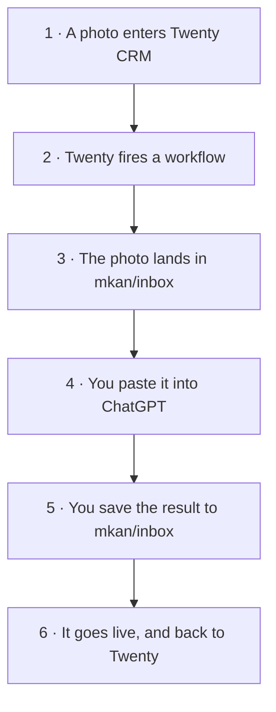

**Mastering** turns a host's bad photo into what a professional real-estate photographer would have shot in the same room. Hosts photograph on cheap phones in bad light; the marketplace should not. Every eligible photo moves through its own tracked run — `QUEUED → ASSIGNED → MASTERED → UPDATED` — with the render made by whichever image model the run names (`chatgpt-image-2` today, Nano Banana before it — the registry takes any of them), a human honesty gate before anything goes live, and no way for an image to disappear silently.

The one rule that outranks quality: **same property, same reality**. The model improves the *photograph*, never the *property* — nothing invented, nothing hidden, no rooms made larger or newer than they are. The gate is human (and the eyeball owns *identity* too: the render must depict *this* run's original — hash checks can't know the room).

## The parts

Seven parts. Each one does a single thing:

| Part | What it does |
| --- | --- |
| **Twenty CRM** | where you put the photo in |
| **The scripts** (mkan) | do all the boring work for you |
| **The database** | remembers every photo and every try |
| **Gemini / ChatGPT** | makes the better photo |
| **Your inbox folder** | where you save the new photo |
| **The CDN** | keeps all the photos, old ones too |
| **Slack #mkan** | tells you what is going on |

## The loop

A photo goes in at the top. A better photo comes out on the website at the
bottom. Six steps, and you only touch two of them.



### What each box means

| Box | In plain words |
| --- | --- |
| **1 · A photo enters Twenty CRM** | Someone puts a photo on a home in the CRM. This is the only thing that starts the loop — nothing else to press or run. |
| **2 · Twenty fires a workflow** | Twenty notices the new photo by itself and sends a signed message to this Mac. Nobody has to tell it. Drop six photos at once and it still runs the next step only once. |
| **3 · The photo lands in `mkan/inbox`** | The signal pulls the photo down to one folder on the Mac. A whole batch can land at once — they wait there for you. |
| **4 · You paste it into ChatGPT** | `pnpm master:prep --standing` takes the next waiting photo, puts it on your clipboard and opens ChatGPT. Then it is ⌘V, Enter. You never type a prompt — the project already carries it (see below). |
| **5 · You save the result to `mkan/inbox`** | Same folder. Saving *is* the whole job — the computer watches that folder and takes over the second the file appears. |
| **6 · It goes live** | The new photo replaces the old one on the website, and Twenty is updated to match. Done. |

There is no separate "check it" step, because you already saw the photo in
ChatGPT before you saved it. Saving **is** the yes. If one comes out wrong,
do not save it — press Enter again.

> **All six boxes are live** (2026-08-24). Box 2 was the last gap and is now
> built: Twenty fires an `attachment.created` webhook at a listener on the Mac,
> which runs the pull. Proven end to end — three photos dropped through the API
> arrived in `mkan/inbox` named by their run, each with its room read off the
> file name.

## Set ChatGPT up once

The single biggest thing that makes this easy is a **ChatGPT Project** holding
the standing instructions. Do it once and it pays on every photo forever.

```bash
pnpm master:prep --setup-chatgpt   # prints the text to paste
```

ChatGPT → **Projects** → New project → name it **master** →
**Instructions** → paste what that command printed.

Why it matters so much:

- **The prompt stops travelling.** It is saved in the project, applied to every
  image you send, so there is nothing to copy, paste or retype per photo.
- **That frees the clipboard for the photo.** ChatGPT's Mac app cannot be
  handed an image file from the command line — it declares no image file types,
  so `open -a ChatGPT photo.jpg` does nothing. Pasting is the only way in. With
  the prompt standing, `master:prep --standing` puts the *photo* on your
  clipboard instead, and the job becomes **⌘V, Enter, save**.
- **Every photo gets the identical prompt.** No drift between photo 1 and photo
  40, which is what makes the output consistent enough to trust without a
  separate review step.
- **It ends the questions.** The instructions finish with *"Return only the
  transformed photograph. Never ask follow-up questions"* — so ChatGPT answers
  with an image, not a conversation.
- **It is the same trick anywhere.** Gemini calls it a Gem, Claude calls it a
  Project. The standing instructions are identical; only the menu differs.

The one thing the project cannot know is **which room** it is looking at — that
varies per photo, and it comes from the file name.

## Naming the photos

Name each photo after its room, in plain lowercase English:

```
bedroom.jpg   bathroom.jpg   hall.jpg   kitchen.jpg   living-room.jpg
```

That name is read as a **room hint** and added to the prompt, so the generator
knows it is lighting a kitchen and not a bedroom. Three rules, all of them
tested:

| Do | Don't | Why |
| --- | --- | --- |
| `bedroom.jpg` | `0001-01-bedroom.jpg` | A name starting with digits is thrown away as a hint — it looks like a machine id, not a room. |
| `bedroom-2.jpg` for the second one | `bedroom2.jpg` | With a dash the number is trimmed and the hint is still `bedroom`. Glued on, the whole name is rejected. |
| `living-room.jpg` | `IMG_4821.jpg` | Dashes become spaces, so the hint reads `living room`. Camera names carry no room at all. |

**You never need to put the listing in the file name.** The photo is dropped on
a home record in Twenty, so the CRM already knows which home and which listing
it belongs to. Your `0001-01` scheme identifies the *listing*; the file name
only has to say the *room*. If you keep them in folders, keep the id on the
folder — `0001-01/bedroom.jpg` works, because only the last part is read.

State truth lives in **mkan Prisma** (`MasteringRun` — absence is the ORIGINAL state; retries append, history never overwritten). Twenty's `home` is the ops mirror (`photoStage` grew `MASTERED`, plus `photosMastered` / `lastMasteredAt`). The CDN is canonical and originals are immortal. Operator runbook: `mkan/docs/image-mastering.md`.

## What a photo is called

```
original   cdn.databayt.org/mkan/temp/0001-01/hall.jpg
mastered   cdn.databayt.org/mkan/0001-01/hall.webp
```

The folder is the listing's own public code — the same `NNNN-NN` the CRM, the WhatsApp outreach and mkan.sd already share. The name is the room. An original never gets that name: it waits in `temp/` under whatever the human called it, because **the clean path is what mastering earns** — the URL alone tells you whether a photo has been through the pipeline.

Three rules hold it together:

- **The name is allocated, never assumed.** A second bedroom and a second *attempt* at the first one both become `bedroom-2`, and a freed name is never reused. That is not tidiness: overwriting `bedroom.webp` would let the CDN keep serving the **reverted** photo for a day — the exact image the revert existed to remove. Because keys can never be rewritten, new mastered objects are cached immutable.
- **The room comes from evidence**, in order: what the operator said, then the original's own filename, then `photo-N` — which is honest about knowing nothing rather than guessing "bedroom". 1086 of 1095 photos are uuid-named today, so most of the corpus starts on that last rung.
- **Forward-only.** Nothing already stored moves; the ugly URLs die as photos pass through.

One human action gates it: writing outside `mkan/uploads/*` needs the mkan IAM user's S3 policy widened to `mkan/*`. The bucket and CloudFront already serve such keys — verified by probe — so it is a single line, and until it is clicked `master:done` refuses with the fix and leaves the run untouched rather than burning a render someone already made.

## What it is worth — the pipeline against doing it by hand

Doing this by hand means: open ChatGPT, paste the photo, paste the prompt, save
the render, open the host photos page, upload it, delete the old one. It works.
It is also how 779 photos quietly become nobody's job.

| | By hand | This pipeline |
| --- | --- | --- |
| **Human time per photo** | ~2 min — mostly finding the photo and re-pasting the prompt | ~20 s — `master:prep --standing` puts the photo on the clipboard; ⌘V, Enter, save |
| **Generating** | the human | the human (identical — this is the whole ceiling) |
| **Which photo is this?** | memory | the run id, the room hint, and the original revealed beside the render |
| **A bad photo** | you remember, or you don't | `revert` puts the original back and records why |
| **What prompt made this?** | unknowable a week later | frozen on the row, enforced by the database |
| **A render nobody ingested** | lost | reported daily until someone acts |
| **Undo, six weeks later** | the original is gone | originals are immortal; `master:revert` is one command |

Read the table honestly: on **speed** the pipeline wins a little, and only
because the prompt stopped travelling. The generate step is human in both lanes,
so **the ceiling is the same** — which is why the API flip, not more plumbing,
is what changes the arithmetic. What the pipeline actually buys is **memory and
reversibility**: every photo has a name, a reason, an original, and a way back.
That is what makes it safe to point at 779 photos instead of five.

## Progress — the real trace (measured 2026-08-26)

Live truth is `pnpm master:status`; this is what five days of it say.

| Listing | Photos | State |
| --- | --- | --- |
| **#1051** Kobar Residence 4 (acceptance batch) | 5 | **1/5 mastered** — photo 2 UPDATED end-to-end and still live; photos 1, 3, 4 QUEUED; photo 5 rejected to trim the batch |
| **#1180** جناح تنفيذي — السكة حديد (heirs set, room-named photos) | 9 | **0/9 live** — photos 1 and 2 were applied on 08-25 and **both reverted the same day**; photo 1 is on attempt 2, the rest QUEUED |

**16 runs · 3 photos ever applied · 2 reverted · 1 net live photo · 779 in the
backlog.** The wiring is done and the loop has run end to end; what has not been
demonstrated is **yield**. Two of the three photos that reached the live site
came back down within days, and neither revert recorded a reason — so whether
prompt v2 fixed what v1 got wrong is, in the data, unanswerable.

**What is actually blocking, in order:**

1. **Yield, not plumbing.** 2 of 3 applied photos were reverted. Until a batch
   of four or five survives a day, queueing the other 112 listings would just
   manufacture work to undo. The fix shipped with this pass is small and
   procedural: `master:revert` now demands a reason, the way `master:reject`
   always has.
2. **Throughput is a human, and the arithmetic is unkind.** One net live photo
   in five days against 779. Even at the tool's best pace — ~20 s of attention
   per photo, which the standing-prompt trick really does deliver — the backlog
   is a full day of someone doing nothing else, spread over however many days
   that day gets split into. **The whole backlog on the API lane prices at ~$30**
   (`legacy` Nano Banana; $79 flash-2K, $134 pro-2K). That decision is on record
   as deferred, and it is the only lever that moves the ceiling.
3. **~~Slack read scopes~~ — resolved.** Verified live 2026-08-26: the kun bot
   holds `groups:history` + `files:read`, and both `conversations.history` and
   `files.list` answer on `C0BS2NZE2AY`. Every doc claimed this was still
   blocking; it has not been for days. The phone lane works.
4. **The queue→dispatch gap.** `queue` and `pull` create runs; `dispatch` hands
   them out; nothing connects the two. Six runs sat QUEUED with no Slack task —
   five of them for 45 hours — while the stall clock, which only looked at a
   seven-day QUEUED threshold, said "all clear". Reconcile now flags an
   undispatched run after a day.
5. **The record was rewritten from outside.** Three dispatched runs had their
   frozen prompt rewritten v1 → v2 on 2026-08-25 while their Slack tasks still
   quoted v1, and five runs show a status the scripts cannot produce
   (QUEUED, but carrying a Slack task — dispatched, then reset). Nothing
   noticed. A Postgres trigger now refuses to let a run's prompt change, and
   reconcile reports impossible states.

**The backlog, measured** (`master:census`, 147 listings): **112 listings / 779
low-quality photos** ready to queue, 9 OK, 26 with no photos at all (24 of those
*published* — a product gap outside this pipeline), 0 needing re-hosting.

## Build ledger

All on mkan `main`, 2026-08-22 → 26:

| Commit | What landed |
| --- | --- |
| `01f2efe` | The loop: `MasteringRun` schema + `master:queue/dispatch/done/reject/revert/status/reconcile`, prompt v1 frozen per row, Twenty fields applied live, #mkan cockpit |
| `7fd17d8` `fa0f79b` | Honest verify URLs (busy listings 404 publicly); channel renamed to #mkan with the bot as member — dispatch unblocked |
| `44863c9` | Twenty creds from Keychain on every apply (first real apply had skipped the rollup) |
| `b4da4e3` | `master:prep` — prompt→clipboard, original→Finder, Gemini open: the no-spend, no-ToS floor |
| `3cc84de` | `gift-handover.ts` (funnel session): mastered photos become the host-outreach gift, read live from UPDATED rows |
| `b0b6e0d` `2c2246b` | Heirs photo sets named by room; filename room hints ground the prompt |
| `9433b7f` | The Slack return lane (`--from-slack`): thread attachment → run-id text → sole-waiting fallback — built because renders happen on the phone |
| `457ca10` | Production hardening: pure core + 10 pinned invariant tests (incl. a real UUID→"room" prompt-leak bug), race-guarded state claim, 🫥 DRIFTED detection, launchd stall clock (daily 10:00), retries keep room hints, cache identity check, `dispatch --repost` |
| `2c52245` | Prompt v2 — four loopholes v1 left open, closed (preservation beats the 4:3 ratio, no fabricated light, no geometry that enlarges a room, no fake HDR) |
| `0b48968` `50c7e83` | **A mastered photo gets the URL a human would have chosen** — `mkan/0001-01/bedroom.webp`, folder = the listing's public code, name = the room; originals wait in `temp/` under their human name; names allocated and never reused so a reverted photo cannot be served from a recycled key; mastered objects written immutable |
| `553c986` | **The loop stops losing work it already paid for** (2026-08-26): a render made while the machine was still re-queueing is no longer refused — a dropped file is judged against its PHOTO's history, not the attempt in flight (`~/Downloads` keeps the strict bar); `revert` demands a reason; the frozen prompt is enforced by a Postgres trigger instead of a comment; reconcile sees undispatched runs, impossible states, and renders stuck in the inbox — eleven on its first run |

## Decisions on record

- **State home:** mkan Prisma, not Twenty — Twenty mirrors, the app's array is what the site serves (settled by evidence, 2026-08-22).
- **Generate lane:** human via a chat app while API billing is deferred — the model is per-run and the default is now `chatgpt-image-2`; the flip (`master:auto`) changes only the generate step, never the state machine or the human gate.
- **No browser/desktop automation of Nano Banana:** no desktop app exists; driving the web app is possible but declined — spec-forbidden, main-Google-account ToS risk, fragile. Supervised prototype only on explicit override.
- **Stall clock is deterministic shell** (launchd, daily 10:00), not an LLM cron.
- **Cockpit:** private **#mkan** (`C0BS2NZE2AY`); the posting identity is the workspace `kun` bot (Hermes' token).

## Next

Finish #1051 (three `master:prep` walks) → reject notes settle prompt v1 → v2 → queue **#1127** (host 1004) and **#1161** (host 1006), whose UPDATED rows light the gift line in host outreach → then Phase 2 (`/admin/mastering` grid fed by the census photo cache, Twenty Kanban auto-queue, Hermes operator skill) and Phase 3 (the billing `/decide`, approve-only human gate).
