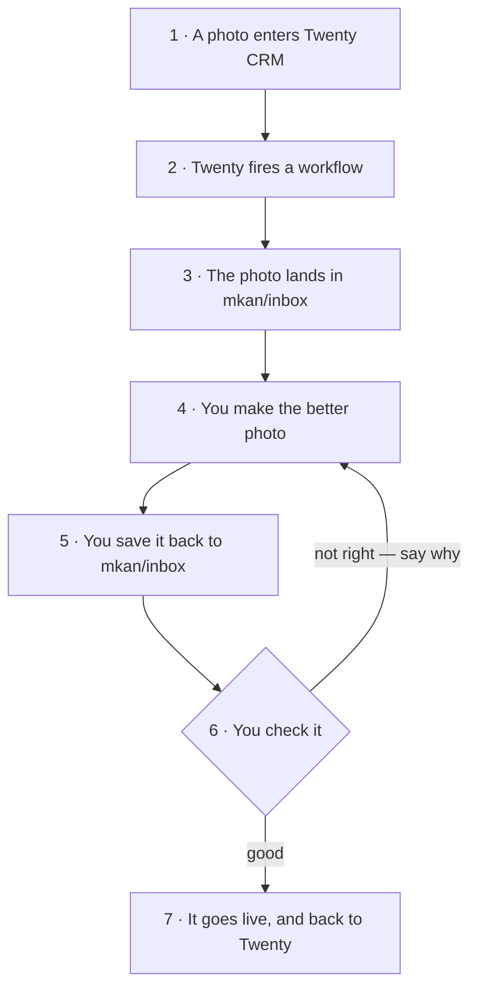

**Mastering** turns a host's bad photo into what a professional real-estate photographer would have shot in the same room. Hosts photograph on cheap phones in bad light; the marketplace should not. Every eligible photo moves through its own tracked run — `QUEUED → ASSIGNED → MASTERED → UPDATED` — with the render made by **Nano Banana** (Gemini), a human honesty gate before anything goes live, and no way for an image to disappear silently.

The one rule that outranks quality: **same property, same reality**. The model improves the *photograph*, never the *property* — nothing invented, nothing hidden, no rooms made larger or newer than they are. The gate is human (and the eyeball owns *identity* too: the render must depict *this* run's original — hash checks can't know the room).

## The parts

Seven parts. Each one does a single thing:

| Part | What it does |
| --- | --- |
| **Twenty CRM** | where you put the photo in |
| **The scripts** (mkan) | do all the boring work for you |
| **The database** | remembers every photo and every try |
| **Gemini / ChatGPT** | makes the better photo |
| **Your inbox folder** | where you save the new photo |
| **The CDN** | keeps all the photos, old ones too |
| **Slack #mkan** | tells you what is going on |

## The loop

A photo goes in at the top. A better photo comes out on the website at the
bottom. Of the seven steps, you only do three.

### What each box means

| Box | In plain words |
| --- | --- |
| **1 · A photo enters Twenty CRM** | Someone puts a photo on a home in the CRM. This is the only thing that starts the loop — there is nothing else to press or run. |
| **2 · Twenty fires a workflow** | Twenty notices the new photo by itself and sends a signal out. Nobody has to tell it. |
| **3 · The photo lands in `mkan/inbox`** | The signal pulls the photo down to one folder on the Mac. Its name says which home it belongs to, so it can never get mixed up with another. |
| **4 · You make the better photo** | Drag it from that folder into ChatGPT. The instructions are already saved there, so you just press Enter and wait. |
| **5 · You save it back to `mkan/inbox`** | Same folder it came from. Saving *is* the whole job — the computer is watching that folder and takes over the second the file appears. |
| **6 · You check it** | Look at the old photo and the new one together. Same room? Still true to the real place? Only a person can answer that. If it is wrong, say why — that is what makes the next one better. |
| **7 · It goes live** | The new photo replaces the old one on the website, and Twenty is updated to match. Done. |

Your part is three boxes: **4, 5 and 6** — make it, save it, say yes.

> **Not switched on yet.** Box 2 is the plan. Today nothing watches Twenty:
> the photo is fetched by a command that has to be run, and the every-5-minutes
> timer that would run it is written but not installed. Boxes 5 → 7 are live
> and working right now.

State truth lives in **mkan Prisma** (`MasteringRun` — absence is the ORIGINAL state; retries append, history never overwritten). Twenty's `home` is the ops mirror (`photoStage` grew `MASTERED`, plus `photosMastered` / `lastMasteredAt`). The CDN is canonical and originals are immortal. Operator runbook: `mkan/docs/image-mastering.md`.

## Progress — the real trace (snapshot 2026-08-23)

Live truth is `pnpm master:status`; this table is the dated snapshot.

| Listing | Photos | State |
| --- | --- | --- |
| **#1051** Kobar Residence 4 (acceptance batch) | 5 | **1/5 mastered** — photo 2 UPDATED end-to-end; photos 1, 3, 4 ASSIGNED (tasks waiting in #mkan); photo 5 rejected to trim the batch |
| **#1180** جناح تنفيذي — السكة حديد (heirs set, room-named photos) | 9 | photo 1 (living room) ASSIGNED — **render returned from the phone and verified faithful**, ingest blocked on the Slack scopes click below; 8 still ORIGINAL |

**Proven end-to-end (2026-08-22):** photo 2 of #1051 went ORIGINAL → UPDATED through the full loop — mastered WebP live on `cdn.databayt.org/mkan/uploads/mastered/`, `photoUrls` slot swapped in a transaction, Twenty shows 1/5 + new cover, Slack thread carries the before/after. The proof also caught the pipeline's defining lesson: the first return was labeled "photo 1" but depicted photo 2 — the visual identity match caught it, and that duty is now doctrine and a playbook row.

**The backlog, measured** (`master:census`, 147 listings): **112 listings / 779 low-quality photos** ready to queue, 9 OK, 26 with no photos at all (24 of those *published* — a product gap outside this pipeline), 0 needing re-hosting.

**Blocked on exactly two human actions:**

1. **Slack read scopes (30 seconds, unblocks the phone lane forever):** api.slack.com/apps → kun app → OAuth & Permissions → Bot Token Scopes → add `groups:history` + `files:read` → Reinstall. The bot posts but cannot read; until then `master:done --from-slack` fails `missing_scope`, and the verified #1180 render waits in its thread.
2. **Google API billing (deferred by decision, 2026-08-22):** the whole 779-photo backlog prices at **~$30** on `legacy` Nano Banana ($79 flash-2K, $134 pro-2K) via the already-wired `gemini-media.mjs --ref` lane. Until the `/decide`, the human generates in the Gemini app.

## Build ledger

All on mkan `main`, all 2026-08-22 → 23:

| Commit | What landed |
| --- | --- |
| `01f2efe` | The loop: `MasteringRun` schema + `master:queue/dispatch/done/reject/revert/status/reconcile`, prompt v1 frozen per row, Twenty fields applied live, #mkan cockpit |
| `7fd17d8` `fa0f79b` | Honest verify URLs (busy listings 404 publicly); channel renamed to #mkan with the bot as member — dispatch unblocked |
| `44863c9` | Twenty creds from Keychain on every apply (first real apply had skipped the rollup) |
| `b4da4e3` | `master:prep` — prompt→clipboard, original→Finder, Gemini open: the no-spend, no-ToS floor |
| `3cc84de` | `gift-handover.ts` (funnel session): mastered photos become the host-outreach gift, read live from UPDATED rows |
| `b0b6e0d` `2c2246b` | Heirs photo sets named by room; filename room hints ground the prompt |
| `9433b7f` | The Slack return lane (`--from-slack`): thread attachment → run-id text → sole-waiting fallback — built because renders happen on the phone |
| `457ca10` | Production hardening: pure core + 10 pinned invariant tests (incl. a real UUID→"room" prompt-leak bug), race-guarded state claim, 🫥 DRIFTED detection, launchd stall clock (daily 10:00), retries keep room hints, cache identity check, `dispatch --repost` |

## Decisions on record

- **State home:** mkan Prisma, not Twenty — Twenty mirrors, the app's array is what the site serves (settled by evidence, 2026-08-22).
- **Generate lane:** human via the Gemini app while API billing is deferred; the flip (`master:auto`) changes only the generate step, never the state machine or the human gate.
- **No browser/desktop automation of Nano Banana:** no desktop app exists; driving the web app is possible but declined — spec-forbidden, main-Google-account ToS risk, fragile. Supervised prototype only on explicit override.
- **Stall clock is deterministic shell** (launchd, daily 10:00), not an LLM cron.
- **Cockpit:** private **#mkan** (`C0BS2NZE2AY`); the posting identity is the workspace `kun` bot (Hermes' token).

## Next

Finish #1051 (three `master:prep` walks) → reject notes settle prompt v1 → v2 → queue **#1127** (host 1004) and **#1161** (host 1006), whose UPDATED rows light the gift line in host outreach → then Phase 2 (`/admin/mastering` grid fed by the census photo cache, Twenty Kanban auto-queue, Hermes operator skill) and Phase 3 (the billing `/decide`, approve-only human gate).
