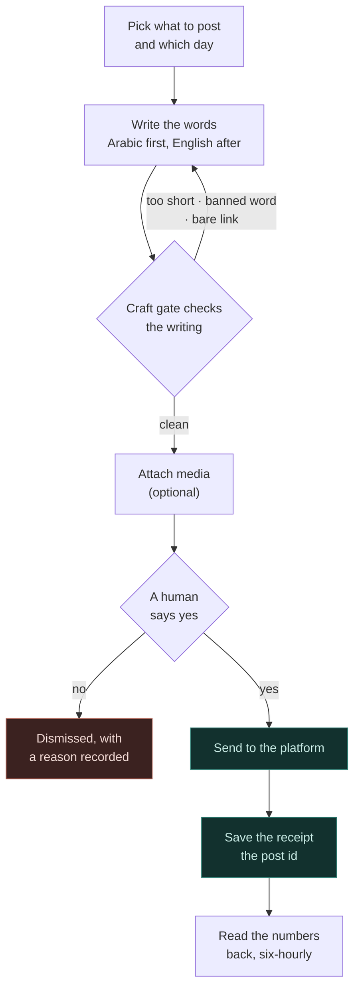
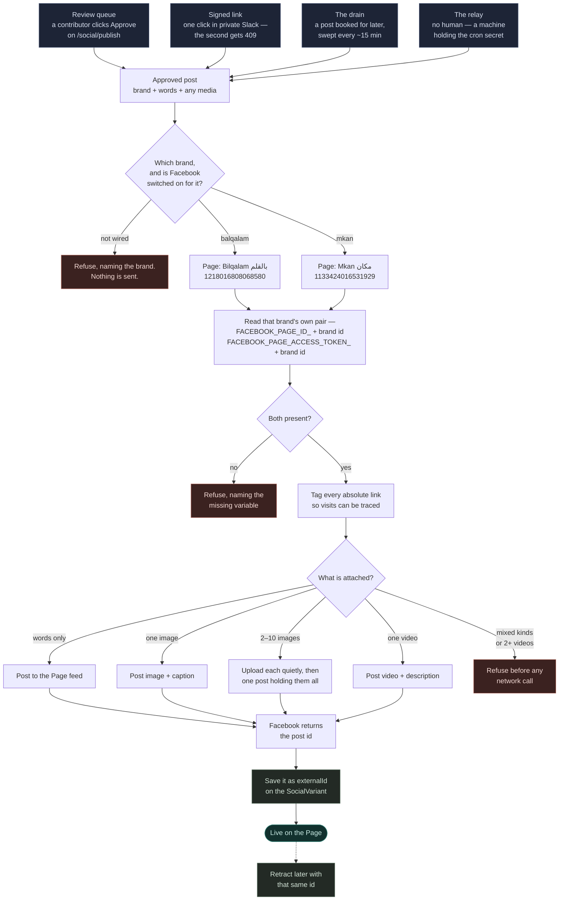

# Social Automation

How databayt turns an idea into a published social post across eight platforms — with Claude
writing the copy, `/higgs` making the media, and a thin gateway doing the broadcast. Each brand
(databayt, Hogwarts, Mkan, Moallimee, Sijillee) runs its own presence off this shared pipeline.
The brand rules every post obeys are in [Brand & Voice](/docs/brand); the build roadmap and
credential plan are internal (`docs/SOCIAL-AUTOMATION.md`).

## How a post travels

Nine steps from an idea to a live page. The first six are about words and permission;
only the last three touch a platform at all.



Four doors open onto **Send to the platform**, and they differ only in who says yes:
the **review queue** on `/social/publish` (a person clicks Approve), a **signed link**
in the private Slack review channel (a person clicks once — a second click gets
`409 Already handled`), the **drain** (a post booked for later, checked every ~15
minutes), and the **relay** (no person; a machine with the cron secret). All four
funnel into one shared egress path — see
[Facebook](/docs/social/channels/facebook#what-happens-when-a-post-is-sent) for that
path step by step.

**The craft gate is not advisory.** It rejects on its own, before a human ever sees the
draft — the first Balqalam draft written against it was refused for `balqalam.com`
without a scheme, because `applyUtm` only tags absolute URLs and the post would have
shipped untracked.

## Sending it out to a Facebook Page

The step above marked *Send to the platform*, opened up. Every door — review queue,
signed link, drain, relay — arrives here, at `deliverPost` (`src/lib/social-publish.ts`)
and then `sendFacebookPost` (`src/lib/facebook.ts`).

Nothing in this path knows a brand by name. It builds the setting name from the brand id,
which is why **adding a Page is configuration and never transport code**.



### Where an approved post comes from

Those four boxes are the **only** four things in the codebase that call `deliverPost`.
They differ in exactly one way — who is trusted to say yes:

| Door | Entry point | Who may open it |
|------|-------------|-----------------|
| **Review queue** | `approveDraft` (`src/actions/post-social.ts`) | A signed-in contributor. `requireContributor()` re-checks the session email against the allowlist on every call |
| **Signed link** | `POST /api/social/publish` | Anyone holding the link — its only protection is being unguessable, which is why the review channel is private. Approving is a one-way status change, so a second click gets `409` |
| **Drain** | `GET /api/social/drain` | The `CRON_SECRET` bearer. Publishes variants whose `scheduledFor` has passed — those were approved earlier, in schedule mode |
| **Relay** | `POST /api/social/relay` | The `CRON_SECRET` bearer. No human at all — the headless lane |

**The words** arrive one of three ways: a contributor files a brief on `/social` and a
Claude Code session drains the queue and writes the copy back through the craft gate
(`scripts/social-drafts.mjs answer`); a reviewer edits copy directly in the queue's
editor, which never creates from blank; or — since 2026-08-25 — the **composer asks for
itself**. Its **Write it** button turns the field plus every setting above it (brand,
feature, post shape, channels, attached media, and the angle/register/model knobs) into
a brief, files it with `requestSocialDraft`, and drops the answer back into the same
field. The inline Gemini lane answers in about eleven seconds; a miss falls through to
the same queue and the same drain, and the box says so rather than spinning. The
answered request becomes the composer's active draft, so approving there consumes it
instead of leaving it approvable twice.

**The media** is attached, never invented at send time: library assets picked by URL
(`content/media/library.json`, or the showroom's **Attach**), landing on
`SocialDraftRequest.mediaUrls` and then `SocialVariant.mediaUrls`. `deliverPost` receives
URLs and nothing else — Graph fetches the bytes itself, which is why they must already be
public on the CDN.

> **A fifth door opened 2026-08-25: the composer itself.** `publishPostDirect` and
> `schedulePost` used to be a publish path with nothing driving it — no route, no
> component. The review queue's composer now calls both: copy typed into the box
> that answers to no queue entry publishes through `publishPostDirect` (Now) or
> `schedulePost` (Later, for the time the Plan tab picks). Copy that came from a
> draft still goes through `approveDraft`, because approving is also a claim.
> The door count is five; who may open this one is the same signed-in
> contributor `requireContributor()` checks on every other call.

**The saved id is the only way back.** Graph returns it once, in its reply; it cannot be
recovered from the variant afterwards, and it is the sole argument `deleteFacebookPost`
accepts. A test post that was never recorded is a test post the system cannot retract.
`sendFacebookPost` deliberately prefers `post_id` over `id`, because on a photo post the
bare `id` addresses the *photo* rather than the post.

Both Arabic-facing Pages were run through this whole path on 2026-08-24 — posted, read
back, retracted, confirmed gone. Neither had ever carried a post before that. The
per-brand ids, tokens and traps live on
[Facebook](/docs/social/channels/facebook#the-two-arabic-facing-pages-end-to-end).

## Business models → who we're talking to

databayt runs on [four business models](https://databayt.org/about). Social marketing serves
each one differently — B2B storytelling for the first three, B2C reach for the SaaS products.

| Model | Type | What it sells | Social job |
|-------|------|---------------|------------|
| **Per Project** | B2B | Custom automation builds for partners | Show the work — case studies, "automate the boring" proof |
| **Partners** | B2B | Outsourced product dev + specialized talent | Attract teams & talent — founder story, capability posts |
| **Codebase** | B2B / B2C | Reusable components, contributor revenue-share (the sharing economy) | Grow the contributor community — open-source, dev-rel |
| **SaaS** | B2C / B2B | Ready-to-deploy products (Hogwarts, Mkan, Souq, Shifa, …) | Sell the product — per-brand consumer & buyer marketing |

The first three are the **databayt umbrella** story (B2B, developer- and partner-facing). The
fourth is where the **product brands** live — each with its own audience, channel mix, and voice.

## Strategy

How we actually win is its own page — [Strategy](/docs/social/strategy): six lenses (**organic ·
viral · when · grow · pay off · moral**), the create-once-repurpose-everywhere multiplier that
makes 5 brands × 8 channels feasible for a small team, per-brand cadence, and the kill criteria
that keep social honest against the cash-flow-first drive.

## Brand pages

Every brand has its own presence. Its audience, channel mix, content pillars, and account status
live on its page:

- [Databayt](/docs/social/databayt) — the umbrella: open source, sharing economy, Kun & dev-rel (B2B)
- [Hogwarts](/docs/social/hogwarts) — school management SaaS (B2B schools + B2C parents)
- [Mkan](/docs/social/mkan) — property rentals (B2C renters + B2B hosts)
- [Moallimee](/docs/social/moallimee) — teachers & tutoring *(pre-launch)*
- [Sijillee](/docs/social/sijillee) — Sudan business accounting *(pre-launch)* (B2B)

> Souq and Shifa are live SaaS products but are not in the current priority-5 social push. When
> they join, they get a page on this same template.

## The pipeline

The stage-by-stage view of the same journey diagrammed in
[How a post travels](#how-a-post-travels) — who owns each step, and what it actually does.

A **full draft is copy AND/OR media** — text · text + image(s) · text + video ·
image(s) only · video only. The stages are wired to each other: pillars seed the draft
queue, media attaches to the draft (`SocialDraftRequest.mediaUrls`), and the answered
full draft queues for a human on `/social/publish`.

| Stage | Owner | Notes |
|-------|-------|-------|
| **Plan** | `calendar` skill · `weekly` cadence · `growth` agent pillars | What to say, to whom, when. `content/social/pillars.json` IS the recurring calendar — the Monday seeder rotates it into the draft queue, and `/social/calendar` renders it with a **Queue now** button |
| **Draft** | `draft` skill — **Claude, natively** — or the **Social Agent window** on `/social` | Arabic-first bilingual copy against [Brand & Voice](/docs/brand), **plus the media half**. The window queues the brief and a Claude Code session on the Max pool answers it — the API lane of D-20260730 has no funded key, so drafting stays on the subscription. Contributor-gated |
| **Media** | `media` keyword → `/higgs` (text-free) · `/carousel` (text-bearing) | **Pick before you generate**: `library.json` by brand + type, or the brief's `(library: id)` hint. New renders register in the library, then attach to the draft (`social-drafts.mjs attach`, or the showroom's **Attach**) |
| **Approve** | `approve` skill → human (Abdout / Ali / Samia) | The gate — the **review queue** on `/social/publish` is the primary lane; a signed 12h link covers a remote approver. See [Autonomy ladder](#autonomy-ladder) |
| **Schedule** | `SocialVariant.scheduledFor` + `/api/social/drain` | The review queue's approve-mode setting: publish right away, or schedule and delegate to the drain, which publishes due variants every ~15 minutes from GitHub Actions. No keyword of its own — it is `publish`'s second verb ("schedule it for tomorrow") |
| **Publish** | `publish` skill → **egress layer** — Telegram + Facebook direct APIs · Hermes-transport channels via the [gateway](/docs/hermes) · WhatsApp as a copy-out block | Egress only — dumb relays, never the LLM. Media routes by shape: text · one photo · 2–10 album/carousel · one video; mixed kinds are refused by name |
| **Measure** | `measure` skill → `/api/social/metrics` → `SocialMetric` | Facebook reach + engagement, six-hourly. UTM tags are applied but not yet consumed — no PostHog in the app |

Each stage is also its own keyword: say "draft a post for hogwarts" and only that stage runs.
`social` is the orchestrator that chains all six.

### The Hub is this table, as routes

`/social` mirrors the pipeline: seven stages across five routes (`/social/<stage>`), in order,
with brand · channels · status above them as context that spans all of them. Each stage is a
page — linkable, shareable — and the bare `/social` opens on **Draft**.

| Route | Stages | What is there |
|-------|--------|---------------|
| **/social/calendar** | Plan | The pillars, live: each brand's briefs with **this ISO week's rotation picks** highlighted (the same math the Monday seeder runs), a queue chip per brief — in the queue · answered · approved · dismissed — and **Queue now** to file one as a draft ask on the spot |
| **/social/draft** | Draft | The Social Agent window. Shows the answered draft's media beside its copy; "Use …" hands copy **and** media to the review queue |
| **/social/media** | Media | The showroom — generated assets (`library.json`) and kept references (`references.json`), filterable by brand and type; decks link to their live renders. **Attach** puts an asset in the publish tray — no copy-pasting URLs |
| **/social/publish** | Approve · Schedule · Publish | The **review queue**, behind one search bar with a **mode row** — All · Drafts · Scheduled · Published — that spans the whole lane: drafts awaiting a decision, plus the variants where the decision is already made. Only a draft loads into the editor, which fine-tunes copy, attachments and channels and never creates from blank; scheduled and published rows are read-only and open the ledger. Approve (now, or scheduled per the settings), Dismiss, or send the signed review link |
| **/social/measure** | Measure | The activity ledger — last 20 variants with status, time, and latest reach/views |

Cross-stage state lives in the layout's provider, which persists across stage navigations: the
agent's queue poll runs on for minutes, the editor keeps its copy, and the **attachment tray**
survives a trip to the showroom and back — switching stages must not throw any of it away.
Taking a draft ("Use Arabic") moves the Hub to **Publish** carrying copy, media, and the request
id, so approving there consumes the queue entry instead of leaving it approvable twice.

### Drafting from the Hub — the two-sided loop

The agent window is how a teammate without a Claude Code session gets copy on the Max
subscription. It has two halves and **both have to run**:

| Who | Where | Does |
|-----|-------|------|
| Any contributor | `/social` → **Draft** | Picks the brand, writes a brief, presses send. The ask becomes a `SocialDraftRequest` and the window polls |
| Any Claude Code session | the repo | Says **`draft`** with no topic → queue mode drains the pending asks through the same brand-voice doctrine, and writes the copy back |

```bash
node scripts/social-drafts.mjs list                                    # what is waiting (incl. mediaUrls)
node scripts/social-drafts.mjs answer <id> --ar ar.txt --en en.txt \
  --media "https://cdn…/hero.png"                                     # the copy + its media half
node scripts/social-drafts.mjs attach <id> --media "url1,url2"         # media alone, after a render
node scripts/social-drafts.mjs fail   <id> --note "what is missing"    # shown to the asker
```

**The brief is the whole input.** The answering session receives the brand and the brief
and nothing else, so a brief that names only a topic gets copy that says only a topic.
Name the fact, the audience, the call to action, and any date, name or link that must
appear. `fail --note` is rendered to the asker verbatim — use it to ask for the missing
piece rather than inventing one.

The queue drains on a schedule: `scripts/drain-drafts.sh` runs every 5 minutes from
launchd on a teammate's Mac, beats a `draft-drain` heartbeat on every look (even when
empty), and only invokes Claude when asks are pending — zero tokens idle. The window
shows the queue's truth while waiting (position + last check), backs off its poll, and
stops after 10 minutes into a "still queued" state; the drain sweep expires asks
nobody answered within an hour — see [Current status](#current-status).

Which of the **three loops** a post travels — Hub, cron draft-and-approve, or the inbound Hermes
relay — plus the actor map, the cron inventory, and the keyword table, are on
[Architecture & Loops](/docs/social/architecture).

## Layer boundaries

The one rule that keeps the architecture honest: **Hermes is a broadcast relay, not a brain.**
Anthropic offers no native "post to X" primitive, so a self-hosted last-mile gateway is a
legitimate egress — but the writing stays Claude-native. This is what reconciles a self-hosted
gateway with the "anthropic-native over self-hosted" doctrine.

| Concern | Layer | Why here |
|---------|-------|----------|
| Write the copy | Claude (in Claude Code / Cowork) | Best model, brand-aware, bilingual — never Hermes' LLM |
| Make the image/video | `/higgs` → Higgsfield CLI | Already governed by budget + brand kit |
| Decide it's good | Human (→ automated gate at L4) | Brand accounts are public and irreversible |
| Reach the platform | Egress layer, routed per transport | **Telegram and Facebook: direct APIs** (plain HTTPS — works from Vercel), drained by kun. Other channels via the [Hermes](/docs/hermes) gateway, which pulls its own work. WhatsApp: no API exists, so a copy-out block |
| Prove it worked | `/api/social/metrics` + UTM | Facebook reach and engagement into `SocialMetric`; UTM tags attribute traffic at our own site |

Note what is *not* in that table: Slack. It is where approvals and notices are relayed, which is
a different job from reaching an audience — see [the channel model](#and-one-channel-that-is-not-one-of-them).

> **Done (Phase 2, 2026-07-10).** The old `generateAndPublishPost` action drafted via the
> gateway's own LLM and never published — a name that lied twice. Rather than rename it, Phase 2
> **removed the in-app draft lane entirely**: drafting is Claude-native via the `/social` skill,
> and the hub is compose → stage → publish only.

## The eight channels

The full set: **Facebook, Instagram, Telegram, TikTok, Snapchat, X, LinkedIn, WhatsApp.** Each
has a very different posting-API reality — some trivial, some paid, some with no organic-post API
at all. Build order follows feasibility, not wish-list:

| Channel | Posting API | Effort | Note |
|---------|-------------|--------|------|
| **Telegram** | Bot API | Trivial | Wired direct (2026-07-10) but **not configured** — the token was never pushed to Vercel and no `TELEGRAM_CHANNEL_ID` exists. Two variables from live |
| **X** | API v2 | Easy (paid) | Pay-per-use since Feb 2026 (~$0.015/post) → `/decide` |
| **Facebook** | Graph API | Medium | **The one live channel** — hogwarts, mkan, databayt |
| **Instagram** | Graph API | Medium | Business account linked to a FB Page |
| **LinkedIn** | Posts API | Medium | Community Management API approval + page admin |
| **TikTok** | Content Posting API | Hard | App audit (~1–4 wks); posts private until passed |
| **Snapchat** | Public Profile API | Limited | Allowlist-only via a Snap contact |
| **WhatsApp** | *(none, ever)* | Manual | No organic posting API for Channels or broadcast lists — not a gate to pass, a capability Meta does not offer. Modelled as `transport: "manual"`: drafted, rendered, and approved like any channel, then handed out as a copy-out block for a human to forward |

Per-channel state — wired vs configured vs live — is on [Status](/docs/social/status), which is
the page to trust when the two disagree.

### And one channel that is not one of them

**Slack is the communication channel**, not a distribution channel. It is the team surface where
approvals and notices land, and it is deliberately absent from the table above: counting an
internal chat as audience reach is how "1 of 9 channels live" came to describe a system with one
live audience channel. The composer does not offer it, the write gate rejects it, and
`/api/social/relay` refuses it by name. Nothing needs selecting — `sendReview` routes there
unconditionally.

The registry expresses this directly: a channel carries a `kind` (`distribution` |
`communication`) that says what it is *for*, orthogonal to the `transport` that says how its
bytes move.

Full matrix, costs, and the aggregator option (Ayrshare covers 7 of 8) are in the internal
roadmap. Per-brand channel priorities are on each [brand page](#brand-pages).

## Autonomy ladder

The north star is fully autonomous publishing. We climb to it in stages — not because autonomy
is hard to code, but because handing a public brand account to an unsupervised bot needs
guardrails first. We are at **L2 on Facebook** — the one live channel: compose or schedule in the
Hub, one-click publish from a signed approval link, drain delivers — and **L1 elsewhere**. (This
previously read "L2 on Telegram", which had the ladder pointing at the channel that cannot
publish at all rather than the one that can.)

| Level | What runs | Human role |
|-------|-----------|------------|
| **L0 — Manual** | Human writes and posts | Everything |
| **L1 — Assisted** | Claude drafts + `/higgs` media | Human posts manually |
| **L2 — Staged** | kun stages copy+media to the dashboard | One-click approve → publish |
| **L3 — Semi-auto** | Auto-publish low-risk channels (Telegram); gate brand channels | Approves brand posts only |
| **L4 — Full-auto** | Autonomous end-to-end | None — replaced by an **automated gate** |

**L4 is gated behind `/decide` + credentials + an automated guardrail layer**: an LLM-judge
content + Arabic-correctness check, per-channel rate limits, and a kill switch. Autonomy without
that layer is not a feature — it's an incident waiting to happen.

## The keywords

Six stage keywords — the pipeline table's seven rows fold onto six words because Schedule rides
`publish`. Each runs on its own; `social` chains all of them, and `carousel` is the multi-slide
sibling with [its own chapter](/docs/social/carousel).

| Keyword | Stage | Say |
|---------|-------|-----|
| **`calendar`** | Plan | "what are we publishing next week" |
| **`draft`** | Write | "draft a post for hogwarts about admission" |
| **`higgs`** | Media | "make the image for it" |
| **`approve`** | Gate | "send it for review" |
| **`publish`** | Deliver + schedule | "publish it" · "schedule it for tomorrow" |
| **`measure`** | Read back | "how did the post do" |
| **`social`** | All six | "social post for mkan about the new listings" |
| **`carousel`** | Multi-slide | "carousel for hogwarts intro" |

They were split out (2026-07-27) because the pipeline above had named these stages and assigned
them owners for months while four of them had no keyword — and Abdout types prose, not slash
commands, so a stage with no name is a stage that cannot be reached. Each skill's `when_to_use`
carries an explicit *negative* clause naming its siblings, which is what stops "publish it" from
routing to `/ship`.

The `growth` agent owns the strategy layer above them; `.claude/vocabulary.json` holds them all
in the *Pensieve* school. No slash needed — say the word.

## Current status

The Social Hub at [`/social`](/social) is multi-product (Phase 3, 2026-07-23):

- **Works** — bilingual (en/ar, RTL) composer with a config-driven channel registry (8
  distribution channels, plus Slack as the one communication channel, which the picker does not
  offer) **× a product registry** (hogwarts · mkan · databayt · sijillee · moallimee). A product
  select — same visual language as the shadcn theme selector — scopes the whole page: channel
  toggles, health checks, and publish all carry the chosen brand.
- **Per-product Facebook** — each brand has its own Page and its own permanent Page token, read
  from `FACEBOOK_PAGE_ID_<PRODUCT>` / `FACEBOOK_PAGE_ACCESS_TOKEN_<PRODUCT>`. The Egress panel
  names the Page the token resolved to, which is how you catch a crossed token before publishing.
  Live for hogwarts, mkan, and databayt; sijillee and moallimee have no Page yet.
- **Per-product wiring** — a channel is publishable only when the global transport *and* that
  brand's own destination are wired (`productChannelWired`). Telegram stays `databayt`-only: there
  is exactly one Telegram channel, org-level, so claiming it for a product brand would post "as
  Hogwarts" into the org channel. Slack is excluded structurally rather than per-brand — it is a
  communication channel, and `productChannelWired` refuses it for every product.
- **Auto-post is draft-and-approve** — a daily Vercel cron (`/api/social/cron`, `CRON_SECRET`-guarded)
  drafts per opted-in product and sends the draft to a private review channel with a signed,
  12-hour, single-use Publish link. The link opens a read-only confirm page and only its POSTed
  button publishes — a chat client's link-preview crawler can never consume an approval. Nothing
  publishes unattended. Opt in per product with
  `SOCIAL_AUTOPOST_PRODUCTS`; empty (the default) means the cron does nothing.
- **Inbound relay** — because Vercel can never reach Hermes on `localhost`, `/api/social/relay`
  inverts the arrow: Hermes drafts, a human approves in Slack, Hermes POSTs the approved text to
  kun, and kun delivers with its own tokens. Hermes never holds a Page token.
- **Drafting stays out of the relays** — `SOCIAL_DRAFT_SOURCE=hermes` (default) hands the ask to
  Hermes; `=anthropic` drafts server-side via the API and is opt-in because the engine's billing
  posture is subscription-only.
- **Media is a set, and it rides the whole chain** — a draft carries `mediaUrls` (≤10 public URLs,
  typically `/higgs` or `/carousel` renders on the CDN) from the ask through approval to delivery,
  which routes by shape: text · one photo (`/photos` edge, `sendPhoto`) · 2–10 as a Facebook
  carousel or a Telegram album (`sendMediaGroup`) · one video (`/videos`, `sendVideo`). Over-long
  copy spills into a follow-up message rather than being truncated. Mixed image+video, two videos,
  or more than ten images are refused by name before anything is delivered, because no platform
  edge carries them. The confirm page behind a signed link lists every URL.
- **Multi-channel, with per-channel truth** — the picker selects any subset of a brand's wired
  channels, the three transports fan out in parallel, and the result names each channel
  individually. A half-landed post no longer reads as one flat failure.
- **Stage for review from the Hub** — the review editor can push the draft down the cron's
  approval path (signed 12h link into the private review channel) instead of deciding in-app,
  for when someone else signs off. Staging retires the queue entry, so a draft cannot be
  approved through both lanes.
- **Scheduling and the drain** — the review queue's approve-mode setting (publish right away, or
  schedule) decides what Approve does; scheduled variants land as `scheduled` and
  `/api/social/drain` publishes them from GitHub Actions every ~15 minutes, claiming each row
  before delivering so two overlapping runs cannot double-post. Its channel filter is an
  allow-list, so a transport added later waits visibly in the queue rather than being attempted
  and silently lost.
- **Metrics** — `/api/social/metrics` reads Facebook reach and engagement back into
  `SocialMetric` six-hourly. A missing scope or a retired metric name is terminal on the first
  attempt with a named remedy, rather than retried forever.
- **Ledger** — `/social` renders the last 20 variants server-side (brand, channel, copy, status,
  time, latest reach/views), so pending approvals, scheduled posts, and publishes are visible
  without SQL.
- **The Social Agent window** (2026-07-30) — the Hub's **Draft** tab: describe the post and Claude
  drafts it, Arabic first with its English sibling; one press moves the Hub to **Publish** with the
  copy in the editor. It is the same ai block as the
  [sales agent](https://demo.databayt.org/en/sales) — `atom/agent-heading`, `atom/prompt-input`,
  `atom/ai-response-display`, ported from hogwarts — so the two windows read as one product.
  The prompt names the selected brand, and says what a good brief contains, because the brand and
  the brief are the *only* things the answering session receives.
  **Asynchronous by design.** The window records a `SocialDraftRequest` and polls; a Claude Code
  session on the Max pool answers it through `draft`'s queue mode. The API lane of
  `.claude/memory/decisions/2026-07-30-in-app-draft-spend.md` shipped but is blocked — no funded key
  exists behind `ANTHROPIC_API_KEY` — so the queue is the live path, and the reasoning panel
  describes that queue rather than performing invented thinking.
  This is not the old gateway-LLM draft card coming back: that card was removed (2026-07-23) because
  a *relay* was writing copy; here the writer is Claude itself.
- **The composer is an editor** (2026-07-30) — the **Publish** tab wears the agent's shape: the same
  band, heading and rounded surface, sized for writing. Media URL and schedule collapsed from stacked
  labelled inputs into two popover pills, so the copy is the only thing on the page with weight.
- **Publish became a review queue** (2026-08-05) — the blank-slate composer is gone. Answered full
  drafts (copy AND/OR media) queue on **Publish** oldest-first: the next one up is highlighted,
  every upcoming one is browsable, and loading one opens the editor prefilled with its copy and its
  attachments. The only actions are decisions — **Approve** (now or scheduled, per a settings
  popover), **Dismiss**, or send the signed review link — and an empty queue points back at Draft
  rather than offering a textarea. Approval claims the request (`answered → consumed`) with the
  same conditional update the drain uses, so two reviewers race safely; a total delivery failure
  hands the draft back with the reason, while a partial one stays consumed because re-approving
  would double-post the channels that landed.
- **The publish queue got a mode row** (2026-08-25) — the search bar over the queue used to see
  only a third of the lane: `listAnsweredDrafts` reads work awaiting a decision, and work already
  decided lives in `SocialVariant`, so "did that one go out?" meant leaving the stage for the
  ledger on **Measure**. `listQueuedVariants` reads the other two thirds, and the bar wears
  hogwarts' category buttons as four split icons — **All · Drafts · Scheduled · Published** — each
  carrying the count of what a search actually landed on rather than the size of its table. A
  filter menu holds the knobs that are a preference rather than a slice (brand scope, order,
  media-only), and every row carries its kind's icon, its channel and its time. **Only a draft
  loads into the composer**: a variant is downstream of a `SocialPiece`, so approving one again
  would mint a duplicate — those rows open the ledger and say so on the row. The queue header's
  count and Refresh moved into the bar rather than standing beside it twice
- **Media is wired to the draft** (2026-08-05) — the showroom's **Attach** fills a provider-owned
  tray shared by the draft ask, the review editor, and the showroom itself; the drain's answering
  session picks assets from `library.json` by the brief's `(library: id)` hint or brand + type and
  passes them with `answer --media`; `/higgs` and `/carousel` end by attaching their render to the
  ask it answers. Copy-and-paste-a-URL is no longer the hand-off.
- **The calendar is real** (2026-08-05) — `/social/calendar` renders `pillars.json` with this ISO
  week's rotation picks highlighted (a TS mirror of the seeder's math, parity-tested), a queue chip
  per brief, and **Queue now** to file one immediately. Calendar → draft is a click.
- **The queue drains itself** (2026-07-30) — `scripts/drain-drafts.sh --install` arms a launchd
  tick every 5 minutes: heartbeat on every look, Claude only when asks are pending. The window
  reads the heartbeat back (position, last check), stops polling after 10 minutes, and the drain
  sweep expires hour-old unanswered asks — a stall now reads as a stall, not an outage.
- **Still pending** — adapters beyond Slack (see [Hermes](/docs/hermes)), per-brand Telegram
  channels, a PostHog destination to consume the UTMs, and per-channel drafting in the cron.
  Tracked in `docs/SOCIAL-AUTOMATION.md`.

## Production Scenarios & Playbooks

The pipeline executes through six canonical, end-to-end production scenarios:

| Scenario | Objective | Tools & Pipeline | Documentation Link |
|---|---|---|---|
| **Mkan Port Sudan Tour** | Coastal rental walkthroughs & listing packs | Media Studio (`9:16` Video · `4:5` Stills) → Twenty CRM → Draft Agent → Multi-channel publish | [Mkan Walkthrough Playbook](/docs/media#scenario-mkan-walkthrough) · [Mkan Brand Page](/docs/social/mkan) |
| **Hogwarts Admission Campaign** | School SIS marketing & zero-paperwork push | Media Studio (`16:9` Ad) → 5-Slide Carousel → Thmanyah Quote Card → LinkedIn / Meta publish | [Hogwarts Admission Playbook](/docs/media#scenario-hogwarts-admission) · [Hogwarts Brand Page](/docs/social/hogwarts) |
| **Airbnb Ad Repurposing** | Adapt proven Airbnb campaigns to Mkan | Showroom Airbnb Shelf → "Use in Studio" → 121 Port Sudan listings | [Airbnb Swipe Playbook](/docs/media#scenario-airbnb-repurposing) · [Twenty CRM Schema](/docs/crm) |
| **Deterministic Quote Cards** | High-trust typography without AI lettering hallucinations | Template Lane → HTML Canvas Engine → Live Visual Card Preview | [Deterministic Cards Playbook](/docs/media#scenario-deterministic-canvas) · [Carousel Docs](/docs/social/carousel) |
| **High-Impact Video Production** | 24fps walkthroughs with Red Sea audio foley | Prompt Compiler → Google Veo / Seedance / Kling → Showroom Brief Queue | [Video Production Playbook](/docs/media#scenario-video-production) · [Google Lane](/docs/media#the-google-lane) |
| **Full Lifecycle Broadcast** | Weekly calendar rotation to measured reach | Pillars rotation → Draft Agent → Review Queue → Scheduled Cron Drain → UTM Metrics | [Social Architecture](/docs/social/architecture) · [Channels Mix](/docs/social/channels) |

## See also

- [Media Studio & Generation](/docs/media) — photo and video generation, prompt compiler, showroom shelves.
- [Status](/docs/social/status) — what is configured and live right now, versus what is merely wired.
- [Ownership & Accounts](/docs/social/ownership) — who actually holds the Meta assets, and what Instagram needs.
- [Channel Setup](/docs/social/channels) — per-platform setup guides, written to be usable on your own accounts.
- [Carousel](/docs/social/carousel) — multi-slide bilingual decks rendered at exact platform sizes.
- [CRM & Listings Schema](/docs/crm) — Twenty CRM listings integration.
- [Brand & Voice](/docs/brand) — the rules every post obeys.
- [Connectors](/docs/connectors) — the MCP-backed service integrations.
- `/higgs` skill — media generation · `calendar` · `draft` · `approve` · `publish` · `measure` · `carousel` · `growth` agent.
