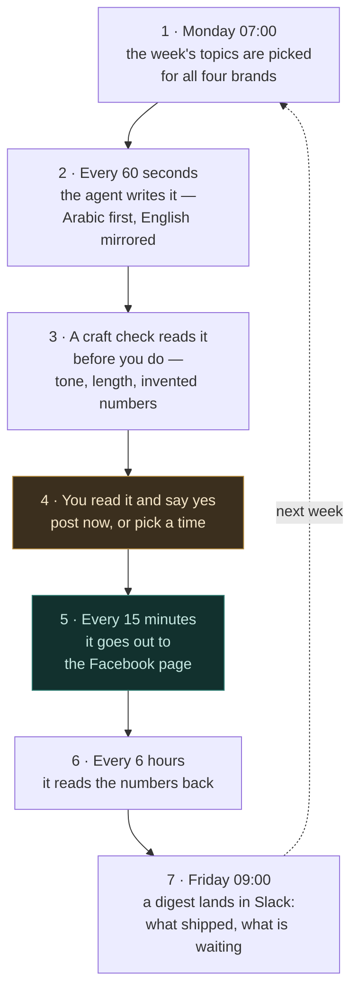
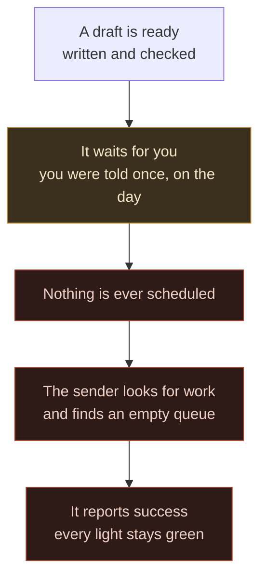

**Social runs on a weekly rhythm, not on someone remembering.** Three timers file the
week's topics, write them, check them, send them and read the numbers back. Exactly one
step has no timer on it: **you.**

The one rule that outranks speed: **nothing reaches a brand page without your yes.** That
is deliberate — it is the only thing standing between a draft and a public page. It is
also the step everything else queues behind, which is why the rest of this page is mostly
about that one box.

## How a post travels

Seven steps. You touch one of them (4); the rest happen on their own.

### What each box means

| Box | In plain words | When | Who |
| --- | --- | --- | --- |
| **1 · Pick** | Reads this week's briefs from the content pillars and files one ask per brand. Four brands, two topics each. | Mon 07:00 | Machine |
| **2 · Write** | An agent answers each ask on the Max plan — Arabic written natively, English mirrored from it. Costs nothing per draft. | every 60s | Machine |
| **3 · Check** | Runs the craft rules: register, length, hollow phrases, and any number that was not in the brief. Today it **advises** rather than refuses. | with the draft | Machine |
| **4 · Approve** | You open the queue, read what was written, and say yes — publish now or schedule it. **This is the only human step.** | once a week | **You** |
| **5 · Send** | Delivers to the brand's Facebook page. Retries up to three times, and never double-posts. | every 15 min | Machine |
| **6 · Measure** | Reads reach, views, reactions, comments and shares back from Facebook. | every 6h | Machine |
| **7 · Report** | A digest in Slack: what was planned, what shipped, the numbers, and **what is still waiting on you**. | Fri 09:00 | Machine |

Steps 1, 2 and 7 run on your Mac. Steps 5 and 6 run on GitHub Actions, so they keep going
whether or not the laptop is open.

## When nobody says yes

This is the failure worth understanding, because it already happened — for **27 days**.

Nothing broke. Every job ran, and every job honestly reported success — because each one
truthfully emptied a queue that nothing had ever reached. **Green meant "nothing to do",
not "it worked."** Three finished posts sat unread for close to a month while the
dashboards stayed clean.

## Why it cannot go quiet again

The old alert fired **once**, the moment a draft arrived. Miss that message and nothing
ever mentioned that draft again — there was no second reminder, ever.

Two things changed:

- **A check runs every morning at 09:00.** If anything has been waiting more than three
  days — long enough to mean a weekly session was missed — it says so in Slack, and keeps
  saying so until the queue is clear.
- **The Friday digest leads with the backlog.** It used to report only what shipped. It now
  opens with what is waiting and how old the oldest item is.

The nudge stays **silent when nothing is waiting**. A message that arrives every day
whether or not it matters stops being read, which is the exact failure it exists to
prevent.

## The one thing to get right

When you approve, **open each draft from the queue** — do not retype its text into an
empty box.

| | What happens |
| --- | --- |
| **Open it from the queue** | The system still knows which request the words came from. It marks that request finished, and the loop closes. |
| **Retype it into an empty box** | The post still goes out — but the original request is never closed, so the loop looks like it never ran. |

This is not a technicality. It is how the loop recorded **zero completed passes in its
first month** while posts were going out: things were published, but none of them were
published *through* the loop.

## Where your step lives

Everything waiting for you is on one page: **`/social/publish`**.

The four brands that publish weekly are **hogwarts**, **mkan**, **balqalam** and
**databayt**. Two more brands exist in the registry — sijillee and moallimee — but neither
has a Facebook page yet, so nothing can be scheduled for them.
